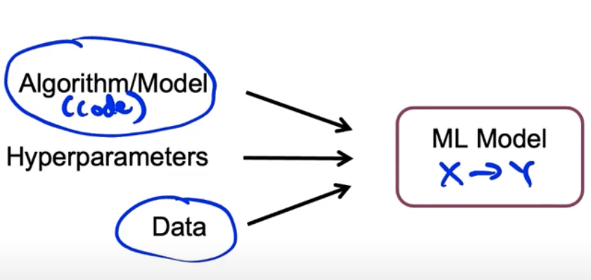
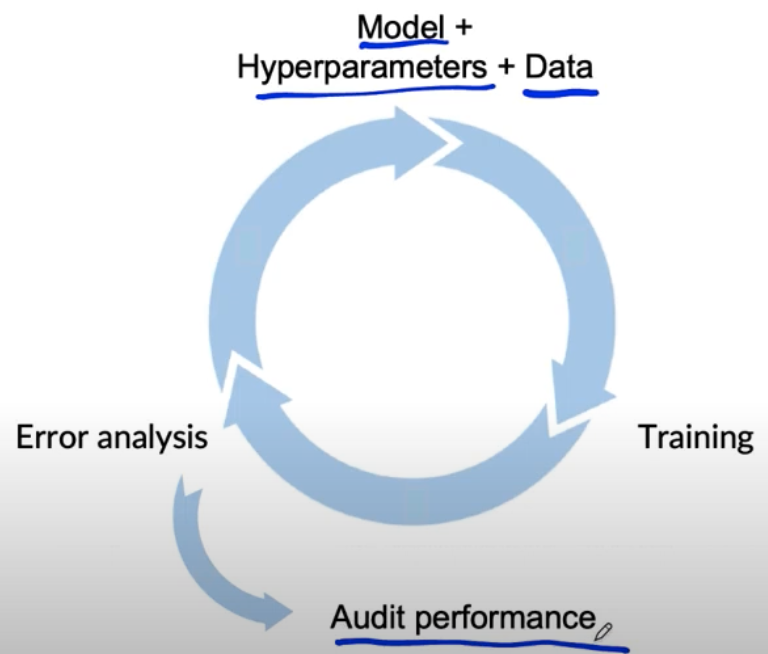

# Lesson 10

## 모델 훈련에서의 어려움

- 프레임워크의 구성
    - AI System = Code(algorithm/model) + Data
    - 프로젝트에 따라 알고리즘 개선이 중요할 수도 있고, 데이터 개선이 효율적일 수 있음, 다만, 데이터는 프로젝트 목적에 알맞게 재구성되어야 함(customizing)

- 모델 개선은 반복적인 과정
 

 
    - ML 모델은 알고리즘 + 하이퍼파라미터 + 데이터로 이루어짐
    - 하이퍼파라미터 조정은 제한적이기 때문에 주로 코드와 데이터 조정에 집중
     

 
    - 위 그림과 같이 모델 훈련의 순환 과정을 여러번 빠르게 반복하는 것이 성능 개선의 열쇠
        - 순환 과정에서 데이터를 어떻게 수정할지, 모델 및 하이퍼파라미터를 어떻게 조정할지 경험을 습득하게 됨
        - Audit Performance: 배포 전 모델이 잘 작동하는지 최종 감사

## 모델 개선에서의 도전과제
- ML프로젝트가 달성해야하는 모델의 목표
1. train set에서 잘 작동
    - 최소한 훈련 세트에서 성능 확보
2. dev/test set에서 잘 작동
    - 교차검증(cross validatin) & 테스트 셋에서 성능 확보, 1에 비해 2는 어려움, 1번 과정은 2번 목표를 달성하기 위한 과정
3. 비지니스 지표/프로젝트 목표에서 잘 작동
    - 1,2번까지의 성능 달성으로는 부족, 시장에서의 목표와 부합해야 함