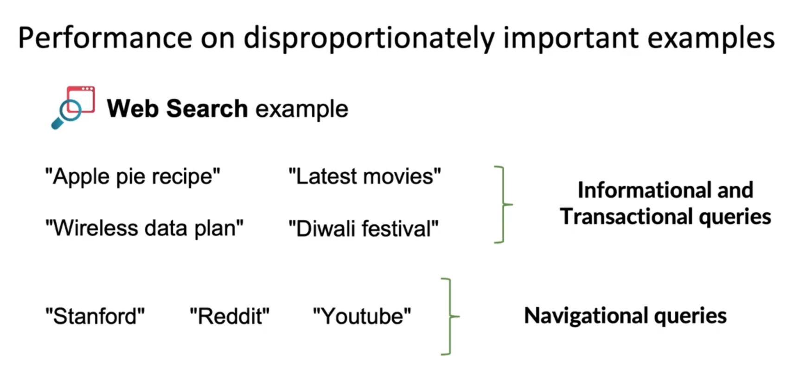

# Lesson 11

테스트셋 뿐만 아니라 프로젝트가 성공하기 위해 수행해야 할 몇가지 사항들에 대해 짚어보겠다.

---

앞서 살펴본 개념의 이동과 데이터의 유입 이외에 고려할 사항들이 있다.

 

## 중요 예제들이 불균형적으로 존재하는 집합에서의 성능

* 중요한 예제들이 불균형적으로 존재하는 데이터셋에 대한 성능이 충분치 않다면 ML 시스템이 평균적으로 에러가 적게 발생하는 테스트셋을 가지는 오류를 지닐 수 있다. 

 

 

* 웹 검색 예시
    - "애플파이 요리법", "최신 영화" 와 같이 무언가에 대해 알고 싶을 때 쓰는 쿼리를 정보와 업무성 쿼리라 한다.
        - 유저는 쿼리와 가장 관련성 높은 검색 결과를 원하지만 2, 3위에 더 좋은 결과가 있다고 해서 그 검색 엔진을 평가절하하지 않는다. 인터넷에는 다양한 결과가 있기 때문이다.
    - 반면에, stanford.edu, reddit.com, youtube.com 은 명확한 의도를 가지고 쓸 때가 많다. 이러한 쿼리를 navigational queries 라고 한다.
        - 유저가 명확한 사용의도를 가지고 검색하기 때문에 첫 번째 검색 결과가 사용자의 해당 서비스에 대한 신뢰도에 영향을 크게 미친다. 
    - 탐색 쿼리가 검색 결과에 미치는 영향력이 크다.
    - 테스트셋의 평균 정확도가 모든 예제를 동등하게 가중시키는 경향이 있는데 반해 웹 검색에서는 일부 쿼리들이 비례적으로 중요하다. 
        - 그 일부 예제에 가중치를 더 줄 수도 있지만 이 방법이 모든 문제를 항상 해결하지는 못한다.
        - 데이터셋의 key slices 에서의 성능이 중요하다.

 

## 데이터셋 key slices 에서의 성능

* 예시1: 대출 승인에서의 ML
    - 많은 정부와 금융 당국은 대출에 있어서 특정 속성으로 차별하지 않도록 의무하하는 법이나 규정을 지니고 있다. 대출 승인 시스템이 높은 정확도를 지니더라도 편견이나 차별을 보이면 배포하기 어렵다. 

* 예시2: 온라인 쇼핑몰에서 상품 추천
    - 모든 사용자, 소규모의 업체, 적절성을 공정하게 처리해야 소비자와 공급자가 해당 플랫폼을 떠나지 않게 만들 수 있다.
    - 대기업 제품만 추천하면 중소기업 업체들은 떠날 것이다. 
    - 사용자의 니즈에 맞는 상품을 추천해야 소비자가 머물 것이다.

 

## 희귀한 클래스

* 한쪽으로 쏠린(skewed) 데이터 분포가 가지는 문제도 있다.
* 의학 분야에서 하나의 질병이 99%는 모든 사람에게 일어나지 않고 1%에게만 일어나는 경우를 어렵지 않게 발견할 수 있다. 
    - 이 경우 항상 0(negative)를 예측하는 알고리즘은 99%의 정확도를 가진다. 
* 즉, 테스트셋에서의 정확도가 생산적인 측면에서 만능은 아니다.

 

## 유의할 점

* 테스트셋에서 좋은 성과를 냈지만 실제 생산 라인에서 적용하지 못하는 기술들이 있다. 이러한 상황에 놓일 때 방어적인 태도를 보이지 말자. 왜냐하면 테스트셋에서 잘하는 것만으로는 많은 생산 어플리케이션에 충분하지 않기 때문이다. 
* 이후에는 오류분석을 통해 실제에서 어떻게 오류를 해결하고 실제에 적용하기 위해 무엇이 필요한지 살펴보도록 하겠다.

