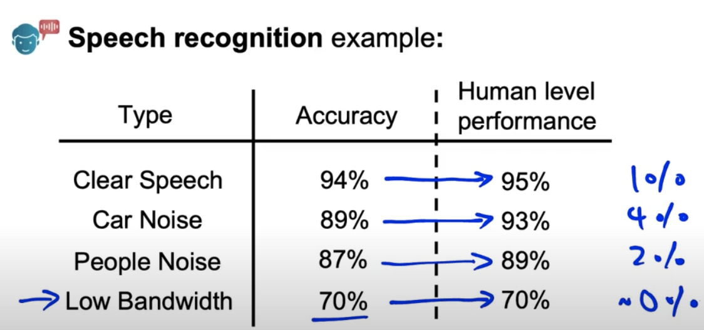
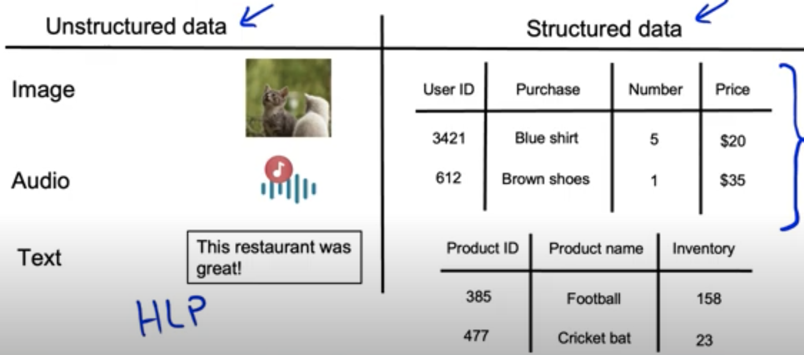

# Lesson 12

기본적인 성능 기준인 model baseline을 만들어야 성능개선 방법을 찾을 수 있고, 개선을 통해 baseline의 수준을 높일 수 있다.

## 모델 기본성능수준(baseline) 구축하기

### 음성인식예제
 

 
- Human Level Performance(HLP, 인간 수준의 성능)을 baseline 성능으로 설정하고 모델 개선의 기준을 가늠 
- 음성 인식 환경에 따라 정확도가 다르다.
    1. 배경 소음 없는 음성
    2. 차 안에서의 음성
    3. 외부 소음 있는 음성
    4. 낮은 대역폭의 음성
- 언뜻 보기엔 4. 낮은 대역폭에서의 음성인식이 정확도가 70%로 성능이 낮아보이지만, 인간 역시 동일 환경에서는 음성인식 정확도가 70%다.
- 인간 수준의 성능과 비교할 때 4번이 가장 인간 수준의 성능에 가깝다. 위 경우 인간 수준 성능과 비교했을 때 성능향상의 가능성이 가장 높은 것은 오히려 2. 차 안에서의 음성이다.(인간수준의 성능까지의 개선폭이 4%로  가장 큼)
- 즉, 성능지표의 절대적인 수치가 중요한 것이 아니며, 문제 상황 별 고성능과 저성능의 수준이 다를 수 있다.

## 비구조화, 구조화 데이터의 baseline

 

 
- 인간은 이미지, 오디오 등 비구조화 데이터 인식에 능숙한 반면 비구조화 데이터 인식에는 미숙

||비구조화된 데이터|구조화된 데이터|
|:---|:---|:---|
|종류|이미지, 음성, 텍스트|엑셀 스프레드시트, DB 내 데이터|
|HLP baseline| 사용|미사용|

## baseline 설정 방법
- 문제 유형별 다른 방식의 baseline 설정 필요
1. Human Level Performance(인간 수준의 성능): ex. 음성인식
2. 최신 리서치/오픈소스: 유사 연구사례의 성능 참고
3. Quick-and-dirty 구현
4. 기존 시스템의 성능
- baseline의 역할: 대략적으로 구현 가능한 성능 수준을 가늠하게 해줌  $\rightarrow$ 불가능한 일에 시간 낭비 방지  $\rightarrow$ 나아가 baseline과 현재 성능의 비교를 통해 프로젝트의 우선순위 설정 가능, 효율적 프로젝트 진행 가능
