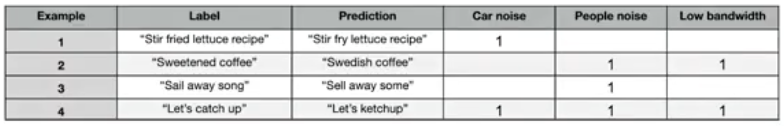
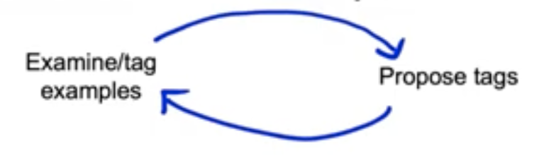
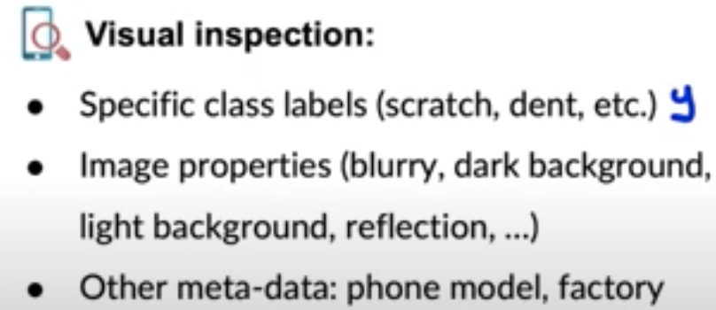

# Lesson 14

- 처음 학습시킨 모델은 대체로 작동하지 않는다. 모델을 학습시킨 후 오류분석을 하는 것이 작동하는 모델을 만드는 관건이다.

## 오류분석(Error Analysis & Performacnce Auditing)
- 오류를 야기하는 요인들을 정리하자.

- 음석인식에서의 오류분석 예
 

 
    - (1) 차량 소음 또는 (2) 사람 목소리 소음이 있을 때 음성인식 결과를 확인한다. 또한 (3) 낮은 대역폭에서 음성이 들렸는지 확인한다. 
    - 앞서 언급한 세 가지 요인은 음성인식 오류의 원인이 될 수 있는 환경이다.
    - 오류 요인들을 엑셀 시트에 수동으로 정리할 수도 있지만, 자동으로 정리 가능한 툴이 많다. 예컨대, 랜딩렌즈를 통해 비전 영역에서 발생할 수 있는 오류의 원인을 추적 가능하다.

## 오류 분석의 반복적 과정

- 오류 요인(태그)들을 검증해보고 아이디어를 얻어 오류 태그를 추가하는 과정을 반복한다.
     

 
-  오류 태그 예. 시각 검사
    - 아래 나열된 태그들을 추적하여 오류 데이터를 표기하고 분석해본다.
     

 
    - 스크래치, 이 등 레이블
    - 이미지 속성(배경 밝기 등)
    - 메타 데이터: 촬영한 공장 등
- 오류 태그 예. 온라인 전자상거래 상품 추천
    - 인구통계학: ex. 노인에게 젊은 여성의 상품 추천
    - 상품 특징/카테고리: 특정 상품군에서만 추천이 잘 작동하지 않음

## 태그 관련한 성과지표(metrics)
- 특정 오류 원인(태그)에 할당된 오류 비중 살펴보기
    - 예. 100개의 음성인식 중 자동차 소음 태그가 존재할 때 예측 오류가 크다면, 자동차 소음이 음성인식에 미치는 영향이 크다는 것을 알 수 있다.
- 전체 오류 대비 특정 오류 원인(태그)의 상황일 때 오류 비중 확인
    - 예. 전체 오류가 18%인데 그 중 자동차 소음이 있을 때의 오류가 12%
    $\rightarrow$ 12/18
- 특정 태그를 가진 데이터의 비중? 
    - 어떤 예에서 특정 오류 원인이 존재하는지 확인
- 특정 원인에서 오류가 발생한 경우의 데이터에서 성능 개선 폭
    - ex. 인간수준성능(Human Level Peformance) 측정 해 현재 성능 수준 대비 개선 가능폭