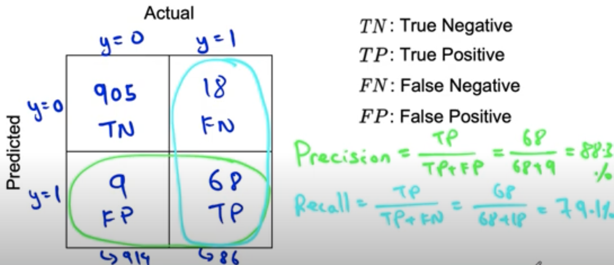
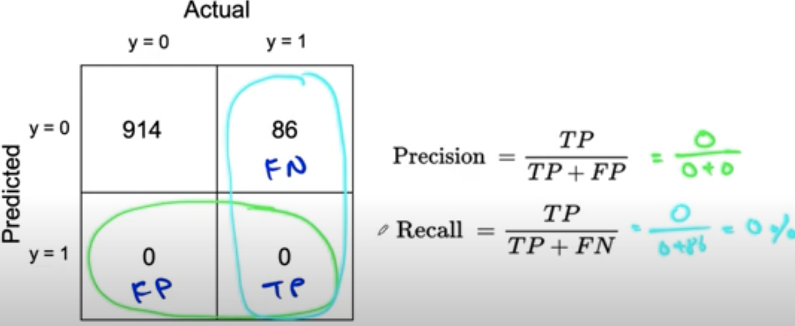
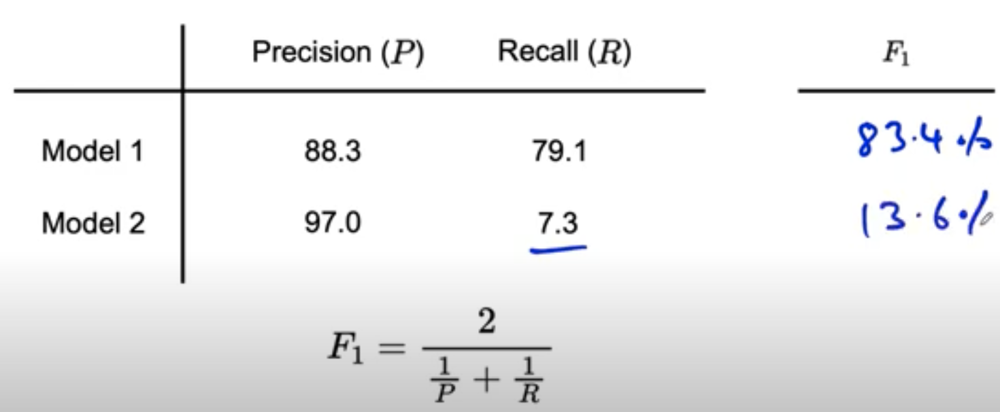
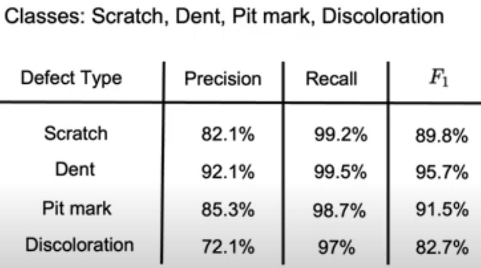

# Lesson 16

## 오차 분석과 성능 추적 - 편향된 데이터에서의 성능지표
- skewed data: 데이터 레이블의 비율이 반반이 아니라 한 레이블에 비중이 치우친 경우
- 예. 제조에서 99%가 미결함이고 1%가 결함이 발생한다고 할 때, 모든 데이터에 대해 미결함으로 예측한다면 예측 정확도는 99%다.
- 편향된 데이터에서는 정확도가 아닌 오차행렬(confusion matrix)로 성능을 평가하는 것이 적절하다.

## Confusion Matrix
 

그림1. Confusion Matrix
 

- 예측결과가 Yes(1) or No(0)인 이진값이라고 하자.
    - TN: 실제값이 No일 때 예측도 No  
    - TP: 실제값이 Yes일 때 예측도 Yes
    - FN: No라고 예측했지만 틀림(실제로 Yes)
    - FP: Yes라고 예측했지만 틀림(실제로 No)
- Precision = (TP)/(TP+FP) = 68/(68+9)
    - Yes라고 예측한 것 중 정답 비율
- Recall = (TP)/(TP+FN) = 68/(68+18)
    - 실제 Yes 중 정답 비율

## Precision and Recall
 

그림2. Confusion Matrix, 모든 예측치 0인 경우
 

- 편향된 데이터에서 모든 예측을 No(0)로 한다면?
- Precision은 분모가 0이 되어 값을 정의할 수 없지만, Recall은 0%로 값을 정의할 수 없다.

## F1 Score
 

그림3. F1 socre 예제
 

- Precision 관점에서는 모델1이 낫고, Recall 관점에서는 Model2가 낫다. F1 score는 두 지표의 조화평균인데, 더 낮은 숫자를 강조하는 효과가 있다. 
- 두 모델의 성능이 Precision은 비슷한 반면, Recall은 모델2가 모델1 보다 현저히 낮다. F1 score는 precsion과 recall을 종합해 모델1이 더 나은 모델이라는 결론을 제공한다.
- 다만, precision과 recall을 종합하는 가중치는 F1 score 방식 외에도 여러가지가 존재한다.

## Multi-class 성능지표
 

그림4. 편향 데이터 & Multi-Class에서의 F1-score
 

- 다중 레이블에서의 성과 지표
- 제조 이상탐지에서는 소수의 결함 제품을 예측해야하기 때문에 이상인지, 결함인지 판단하는 정확도 보다(precision)는 이상 제품에 대한 예측 정확도를 높이고 싶어한다.(recall) 따라서 precision이 비교적 낮은 수치인 것은 큰 문제가 되지 않는다. F1 score를 통해 precision이 비교적 낮더라도 recall 성능이 좋은 결함 유형을 찾을 수 있다.
- F1-score로 결함 유형별 이상 탐지 성능을 순위화하고, 일의 우선순위를 정할 수 있다.
