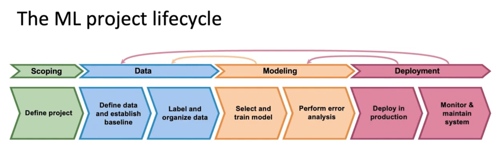

# Lesson 2

* 머신러닝 시스템을 만들 때  머신러닝 프젝트의 생명주기를 고려해야한다. 자세히 말하자면, 아래 그림과 같은 내용을 포함한 프레임워크를 통해 프로젝트에 필요한 모든 것을 계획하고 적용해야 한다. 이러한 작업은 자연어, 이미지등의 비정형 뿐 아니라 정형 데이터 프로젝트에도 필요하다.

## 머신러닝 생명주기 개요
 

 
* scoping 
    - define project: 머신러닝을 적용할 분야 정의   ML Project가 예측모델이라면, 예측대상인 y와 설명변수인 X를 정의
* Data
    - 데이터 정의와 기준 세우기
    - 데이터 표기, 정리: 일관성있는 기준으로 데이터 표기
* Modeling
    - 모델 선택과 학습
    - 오류분석
        - 오류분석을 통해 필요하다면 이전단계 반복, 데이터 추가 수집, 모델 개선 등
        - 배포가 가능할만큼 믿을만한 모델인지 검증
* Deployment
    - 소프트웨어 배치
    - 시스템 모니터링, 유지보수   ex. 데이터 분포의 일관성을 모니터링 $\rightarrow$ 현재 수집되는 데이터가 과거와 다르면 ML model 업데이트함