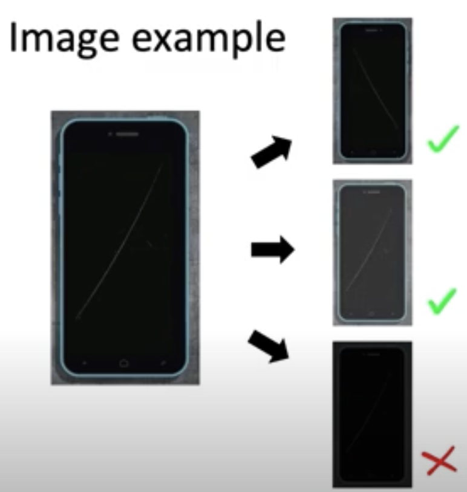
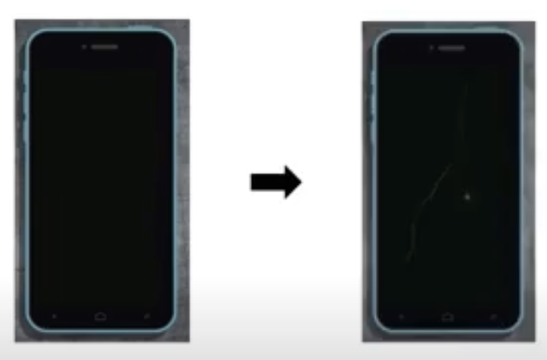
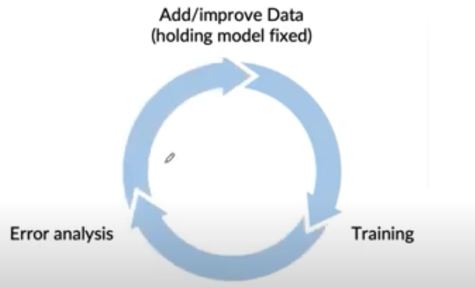

# Lesson 20

## 데이터 증강(Data Augmentation)

- 이미지, 텍스트 등의 비정형 데이터에서는 데이터 증강이 데이터를 확보하는 유용한 방법이다.
- 증강 데이터 생성 시 고려할 점을 알아보자.
---

## 목표 및 주의점

- 목표: 데이터 증강을 통해 다음 조건을 만족하는 데이터를 생성
    - 조건1. 알고리즘이 잘 학습하지 못할 데이터를 생성
    - 조건2. 알고리즘은 잘 학습 못하지만 사람(앞 강의에서는 인간수준성능, HLP로 설명, 또는 baseline)은 판단할 수 있는 수준의 데이터 그러나, 사람 또는 baseline조차 판단 불가능한 데이터는 만들지 않음 ex. 소음이 극심해서 사람도 판단할 수 없는 음성

- 체크리스트(음성인식의 경우)
    1. 현실적으로 들리는가?
        - 기존에 가진 훈련 데이터와 마찬가지로 실제 있을법한 데이터를 생성
    2. X-y 맵핑이 명확? 인간은 생성된 증강 데이터 음성 인식 가능한지
        - 모델이 판단할 가치가 있고 클래스 또는 y 값이 명확한 데이터 생성, ex. 소음이 너무 심해 판단이 불가한 데이터는 추가하지 않음
    3. 기존 알고리즘이 새로 생성한 데이터에 대해 잘 작동하지 않는가?

- 주의할 점
    - 증강 데이터를 생성할 때마다 데이터 증강에 사용되는 매개변수를 매번 바꾸고 모델을 처음부터 새로 학습하는 것은 비효율적

## 예제

- 음성인식에서의 데이터 증강 예제(음성 + 배경음)
    - 음성 + 카페 소음: 시끄러운 카페에서 말하는 데이터 생성
    - 음성 + 음악: 라디오 같은 음성 데이터 생성 

- 이미지 예제: 스크래치가 있는 핸드폰 탐지
    ||
필터 조정
|
이미지 추가
|
    |:---|:---|:---|
    |개념그림|    

|    

|
    |설명|오른쪽 세 개의 이미지를 차례로 서술하면,   1. 좌우반전: 훈련 데이터에 추가   2. 색반전: 훈련 데이터에 추가   3. 어두운 이미지: 너무 어두워서 인간조차 판단 불가  $\rightarrow$ 훈련 데이터에 미포함 | 1. 스크래치 없는 이미지에 포토샵으로 스크래치 추가   2. GAN과 같은 생성모델로 스크래치 이미지 생성|

## 모델 반복(model iteration loop)

- 반복 루프를 통해 모델 개선
    - 데이터를 추가하는 과정을 모델 개선 순환에 넣어 모델 개선
