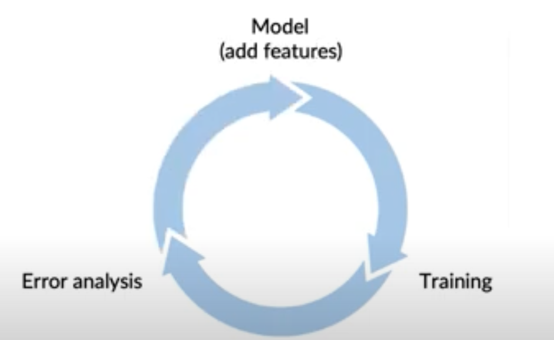

# Lesson 22

## 피쳐 추가하기
- 비정형 데이터와 달리 정형 데이터의 경우 데이터 증강이 어려움
- 데이터 증강 대신, 피쳐를 추가(정형 데이터의 경우 데이터 종류나 수가 제한적인 경우 데이터 수 추가가 불가능)

---
## 피쳐 추가 방법
- 기존 모델이 잘못 작동하거는 경우를 보완할 수 있는 피쳐를 추가(I. 레스토랑 추천 앱 예제)
- 특정 유형 데이터에 잘 작동할 수 있는 피쳐 추가(II. 음식 배달 앱 예제)

### I. 레스토랑 추천 앱 예제
- 사용자 관련 피쳐, 레스토랑 관련 피쳐 $\rightarrow$ 모델(알고리즘)  $\rightarrow$ 레스토랑 추천
- 오류 발생: 채식주의자에게 고기 레스토랑 추천
    - 오류 발생 원인: 고정된 사용자 데이터 & 데이터 내 레스토랑 종류 적음
    - 모델 보완 방안: 베지터리언 고객에게 베지터리언 레스토랑을 추천할 수 있도록 피쳐 추가
        - 피쳐1. 사용자 관점: 베지터리언 여부
        - 피쳐2. 레스토랑 관점: 베지터리언 메뉴 보유 여부, 채식에 특화 여부
    - 피쳐 추가 방법: 수동 혹은 자동(ex. 알고리즘을 통한 메뉴 자동 분류$\rightarrow$ 피쳐2 추가)
### II. 음식 배달 앱 예제
- 특정 메뉴만 주문하는 사용자(ex. 커피만, 피자만 주문)
    - 의사결정에 영향을 미치는 기준을 피쳐로 추가
    - 아래 2. 콘텐츠 기반 필터링을 참고해 특정 유형의 사용자가 제품을 선택하는 특징(제품의 내용, 콘텐츠)을 피쳐로 추가
- 추천시스템(1 $\rightarrow$ 2 추세)
    1. 협업 필터링(사용자 관점)
        - 특정 사용자와 유사한 사용자들이 선호하는 제품을 추천
    2. 콘텐츠 기반 필터링(레스토랑(제품) 관점)
        - 사용자가 구매한 적 있는 제품과 유사한 내용의 제품 추천
        - 장점: 크게 선호되지 않는 제품이라 하더라도 해당 제품의 내용을 탐색함 
        참고. "cold start": 충분한 정보가 수집되지 않은 제품을 추천할 수 없는 문제 
        협업 필터링 방식과는 달리 콘텐츠 기반 필터링은 구매된 적 없는 새 제품 추천 가능

## 모델 개선 순환 과정
 

 
- 정형 데이터는 인간수준성능을 도입하기가 어렵다. 사람이 정형 데이터의 X-y 맵핑을 도출하기는 어려움
- 대신, 오류분석(ex. 사용자 피드백, 경재사의 피쳐추가 참고)을 통해 특정 유형, 카테고리 데이터 식별 개선을 통해 모델 개선
    - 오류분석을 통해 모델이 잘 작동하지 않는 경우를 탐색하고, 이를 잘 포착할 수 있는 피쳐를 추가해 모델 개선
- 참고. 피쳐 추가 필요성 차이
    - 비정형 데이터(unstructured data, 이미지나 음성 등): 데이터 증강 툴도 많으며 보통 데이터 수가 큼. 데이터 수가 클수록 end-to-end로 딥러닝 알고리즘이 잘 동작하는데, 데이터 증강까지 여러 툴을 통해 자동으로 가능하니 비정형 데이터는 세심한 피쳐 추가가 필요 없음
    - 정형데이터(structured data): 여전히 데이터 수가 적은 분야가 많음. 에러 분석을 통해 수동으로 모델을 개선해야 함(모델 개선에 필요한 데이터의 특징 파악 후 피쳐 추가)