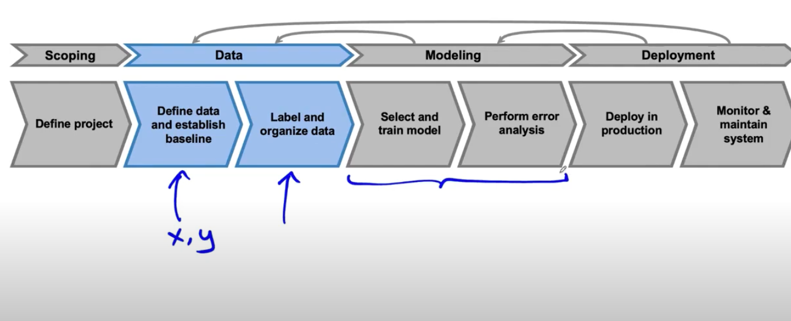

# Lesson 25

## 데이터 정의가 어려운 이유

성공적인 모델링을 위해 데이터를 무엇으로 정의하는 지는 쉬운 일이 아니다.

---

### 예시: 이구아나 레이블링 

이구아나 사진의 위치를 표시해달라는 레이블링 작업에서 작업자들은 다음과 같이 다르게 작업할 수 있다.

 

 

좌상단의 레이블링을 선호하긴 하지만 일관되게 각 정책을 따른다면 문제는 없다. 
다만 각각 다르게 레이블링 하면 알고리즘은 혼란스러워 할 것이다.

 

### 예시: 휴대전화 흠집 레이블링 

실제 산업 현장에서도 레이블 이슈는 있다.
동일한 휴대전화에 대해 다른 레이블링을 할 수 있다. 위 예시와 동일하게 일관성이 중요하다.

 

 

## 데이터 단계

데이터 단계에서는 데이터 정의(입력 X가 무엇이고 출력 y가 무엇인지) 에 대해서 다루고 베이스라인을 세운다. 
그 다음은 레이블링을 하고 데이터를 조직한다.

이러한 데이터셋이 그 다음 단계인 모델링에서 사용되기 때문에 데이터 단계에서 작업은 프로젝트의 성과에 큰 영향을 미친다.

 

 

