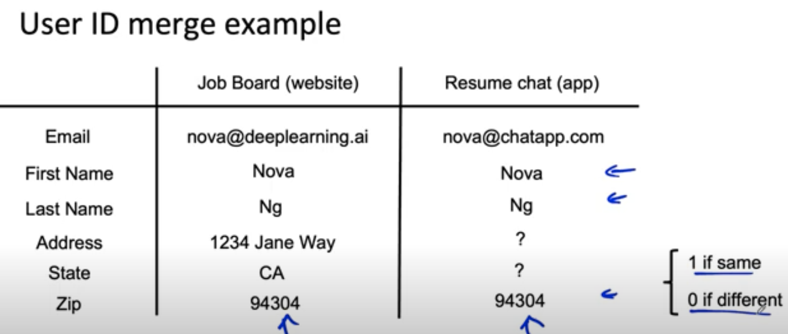

# Lesson 26

## 데이터 정의의 어려움
- 데이터 종류(구조화, 비구조화)에 상관없이 데이터를 정의하는 것은 어렵다. 그러나 좋은 성능의 모델을 만들려면 좋은 품질을 가지고 일관된 기준으로 확보된 데이터가 필요한다.
- 데이터를 정의할 때에는 모호한 특성을 구조적인 기준 틀에 넣어 체계적으로 정의될 수 있게 해야 한다.
- 구체적으로, (1) 데이터가 충분한 범주의 특성을 포함하고 있는지 확인하고, (2) 좋은 품질의 데이터가 수집될 수 있는 환경을 조성해야 하며, (3) 일관된 기준으로 label이 수집될 수 있도록 기준을 세워야 한다. 

## 데이터 정의 예제
1. 비구조화 데이터: 음성인식 예제 
    - 차가 지나가는 상황에서 들리는 음성에 대해 청자에 따라 다음과 같이 받아 적을 수 있다.     
        - 음, 가장 가까운 주유소...
        - 으음, 가장 가까운 주유소...
        - 가장 가까운 주유소(인식불가)
    - 동일한 음성에 대해 일관되게 들리는 말을 작성하는 것은 어렵다.
3. 구조화 데이터: 데이터 병합 예제
    - 두 테이블을 병합하려고 하는 경우, 어떤 정보를 동일한 정보라고 인식하여 병합해야하는가는 모호할 수 있다.
     

 
    - 위 예에서 동일인을 판단하는 컬럼을 세우는 기준은 사람마다 다를 수 있다.
    - 위와 같은 작업을 통해 서로 다른 사이트에서 동일 사용자를 추적하면 그 사용자의 라이프 사이클 및 추가 정보를 알 수 있다.(단, 사용자의 개인정보를 보호할 수 있는 범위 내에서 동일인 판단 작업을 수행해야 한다.)
    - 일관되고 무작위성이 없으며 잡음이 적은 방식으로 동일인 판단 로직을 적용해야 알고리즘의 성능을 높일 수 있다.

## 데이터 정의 고려사항
### Input X
1. 높은 품질의 데이터를 확보할 수 있는 방식으로 데이터를 수집
    - 불량 탐지 이미지 인식 예. 불량이 보일 수 있는 밝기의 이미지가 수집될 수 있도록 함
2. 반드시 포함돼야하는 기능 정의
    - 유저 테이블 병합 예. GPS 정보가 동일인 판단에 필수적이라면 GPS 컬럼을 병합키에 포함
### Label y
1. 데이터 레이블을 매기는 사람들이 일관되게 레이블을 매길 수 있도록 함