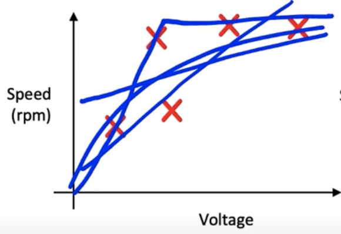
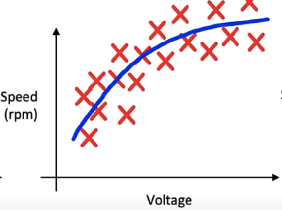
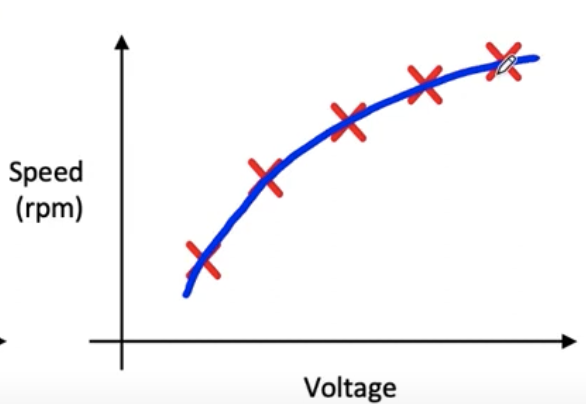
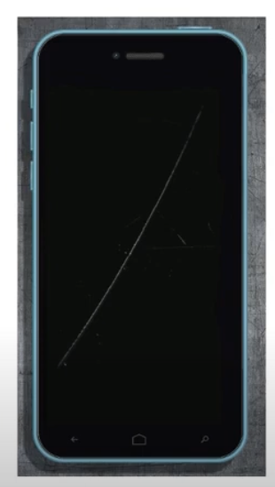
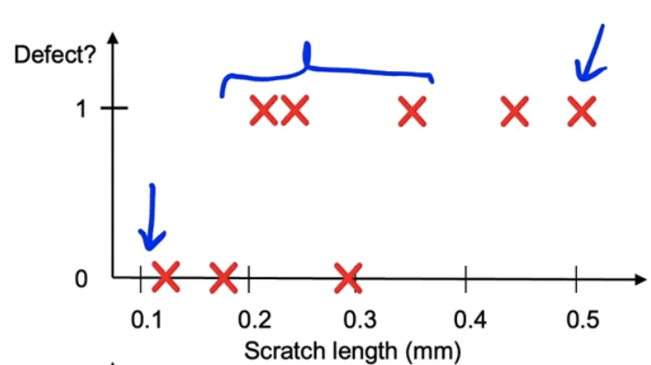
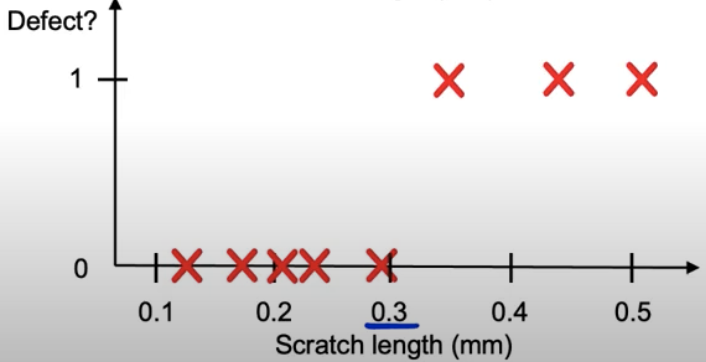

# Lesson 28

## 소규모 데터터와 레이블 일관성
- 인터넷 로그 데이터와 같이 대규모 빅데이터라면 레이블 수집에 자음이 있더라도 모델링이 가능하다. 하지만 현실에는 그 정도 규모의 데이터를 확보하지 못한 기업들도 많다. 그렇다면, 확실하고 일관된 기준으로 label을 매긴 데이터를 확보한 후 모델링을 진행해야 한다.
- 빅데이터라 할지라도 clean label은 여전히 중요하다. (모델링 가능 여부와는 별도 문제로)

## 헬리콥터 엔진 제어 문제 
- 전압에 따른 속도 측정 문제

|small & noisy|big & noisy|small & clean|
|:---|:---|:---|
|

|

|

|
|- 소규모 데이터, 잡음이 많은 레이블   - 어떤 선을 그어 전압-RPM 간 관계를 설명할지가 모호|- 빅데이터, 잡음이 많은 레이블   - 잡음이 많지만 전압-RPM 관계를 설명하는 곡선을 그릴 수 있음| - 소규모 데이터, 깨끗한(일관성 있는)레이블   - 전압-RPM 관계를 설명하는 함수를 만들 수 있음|

## 핸드폰 결함 판단 문제
    
|핸드폰 액정 검사|비일관적인 결함 판단|일관적인 결함 판단|
|:---|:---|:---|
|

|

|

|
|스크래치가 있는 액정|- 스크래치 길이에 따라 검시관마다 결함 판단을 다르게 함|- 스크래치 결함 판단 기준을 0.3mm 이상으로 고정한다면 일관된 결함 label 수집 가능   $\rightarrow$ 더 높은 성능의 알고리즘 구축 가능|

## 빅데이터 내 스몰데이터 문제
- 빅데이터라 하더라도 long tail 분포를 가진 데이터, 즉 희귀한 사건이 발생하는 데이터의 경우 small data에서 발생하는 문제가 발생한다.
    - 웹검색에서 드물게 발생하는 쿼리에서의 스트림 데이터
    - 자율주행자동차 운행 데이터 중 드문 경우의 수로 발생하는 사고(ex. 고속도로 한 가운데에 서있는 아이)
    - 수천개 이상의 종류의 상품추천시스템: 상품 항목 당 데이터는 적음
- 빅 데이터라 하더라도 레이블이 일관되어야 위의 문제를 해결하는 데에 도움이 됨