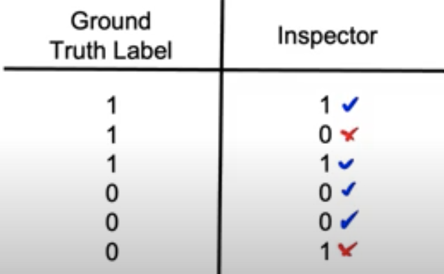

# Lesson 30

## 데이터 정의와 베이스라인 구축: 인간수준성능(HLP, Human Level Performance)
- HLP는 ML system이 도달할 성능 수준을 제시하는 유용한 지표다. 그러나 성능 "수치"에만 집착하여 HLP를 남용할 수 있으므로 이를 주의해야 한다. 성능 수치가 아니라 실질적으로 유용한 시스템을 만드는 데 집중하자. 실질적으로 도움이 되는 시스템을 만들기 위해 위해 레이블을 일관성 있게 수집했을 때 모델 성능 개선 또한 가능하다.

## HLP 사용 이유

|
HLP 이미지
|
이미지설명
|
HLP 측정 이유
|
|:---|:---|:---|
|

|- 실제값(Ground Truth Error)과 검시관(사람)의 값을 비교했을 때 정확도(HLP)가 66.7%  - HLP를 한참 뛰어넘는 99% 정확도를 가진 모델 구축은 어려울 것|- 오류분석과 태스크 우선순위 설정을 위해  *베이즈에러/축소 불가(irreducible) 에러를 측정   - 모델 성능 개선의 상한선, 데이터 특성 상 더이상 오차를 줄일 수 없는 수준|

- Ground Truth Label은 무엇인가?

## HLP 활용 분야

- (academia) 신뢰하고 존경할만한 성능수준, 알고리즘이 HLP를 넘는다면 논문 기고
- (business) 비즈니스에서 요구할 수 있는 합리적인 성능 수준
- ML 시스템의 증명: HLP 이상의 성능을 통해 인간의 인식능력보다 ML 시스템이 우수함을 보임, 비지니스 오너에 ML system 도입 요구 $\leftarrow$ !!주의해야 함!!

## HLP 남용

- HLP를 우월성의 증명 수단으로 사용할 때의 문제점
- 예. 음성인식 예. 동일한 음성에 대해 
  (1) 70%는 "음...주변 주요소" 
 (2) 30%는 "음, 주변 주요소" 
 라고 답함 
    - 두 labeler(음성을 듣고 받아적는 사람)가 정답을 인정할 확률은 $0.7^2 + 0.3^2=0.58$ 
    ML 시스템이 (1) 방식을 기준으로 구축되면 70% 성능을 가진다. 
- (1)로 답하는 것이 (2)로 답하는 것보다 우월한 것이 아니다. 위 예제에서는 ML system이 인간성능보다 12% 높아보이지만, 레이블 표기방식의 차이에 따른 성능의 숫자상의 차이이지 유효한 성능의 차이가 아니다.
- 본질적으로는 높은 성능이 아닌데 위의 경우와 같이 특수한 경우(표기 방식 중 (1)이 대다수인 경우)만 잘 맞추는 모델의 경우 다른 종류의 데이터를 인식할 때에는 더 큰 오류를 범하는 모델이 된다.