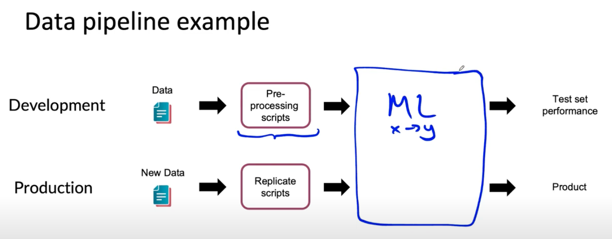

# Lesson 33

데이터 파이프라인을 data cascade 라고도 한다. 최종 출력으로 가기 전에 데이터가 여러 단계를 거치는 것을 의미하기 때문이다. 이런 데이터 파이프라인을 관리하는 데에 있어 몇 가지 좋은 관행이 있다.  

* 사용자 정보를 x 라고 하고 목표 y는 사용자가 일자리를 찾고 있는지 여부를 예측하는 것이다. 
* raw data를 ML 알고리즘에 넣기 전에 데이터 전처리를 해야 한다.
    * 데이터 전처리
        - 스팸 메일 청소
        - 사용자 ID 통합
        - 등등
    * 배포 과정에서도 이 전처리 과정이 포함되어야 한다. 
        - 전처리가 스크립트 형태로 자동화되어야 하고 그 스크립트로 인한 데이터가 학습할 때 쓰인 데이터와 분포가 동일하다는 것을 확인해야 한다.  
        - 전처리 스크립트의 복제 가능성을 증명하는 것은 프로젝트의 단계에 따라 달라질 수 있다. 

 

 

학습과 배포 과정에서 100% 이 복제가능성을 보장하지 않아도 된다고 말하는 것이 비판의 대상이 될 수 있다고 느끼지만 응 교수는 어느 정도 허용 여지가 있다고 본다.

### POC 와 생산 단계

* POC(proof-of-concept, 개념 증명 단계)
    - 이 단계에서의 목표는 그 어플리케이션이 작동가능하고 배포할 가치가 있는지 결정하는 것이다.
    - 작동하는 프로토타입을 만드는 데 집중하는 것이 중요
    - 데이터 전처리 과정이 수동으로 이루어진 것 허용. 다만 그 과정에서 나온 다양한 이야기나 논의들을 광범위하게 기록해두기 --> 결국에는 자동화를 해야 복제가능성을 높일 수 있다.
* 생산 단계 
    - 데이터 파이프라인이 복제될 수 있는지 더 정교한 도구들을 사용한다.
    - e.g., Tensorflow Transform, Apache Beam, Airflow, ...