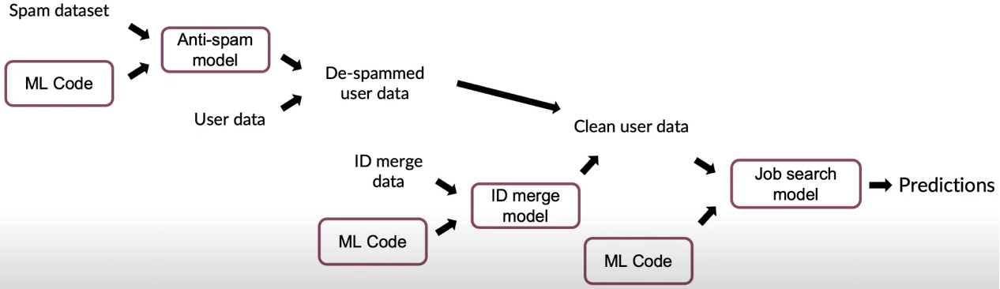
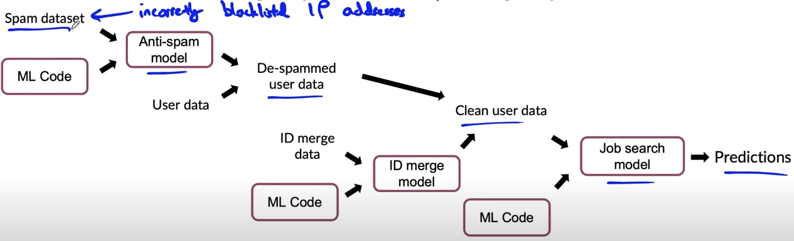

# lesson 34

## 메타 데이터, 데이터 출처 그리고 데이터 계통
- 오류 발생 시, 데이터의 처리 흐름과 출처 정보를 알고 있다면, 오류 현상이 영향을 끼치는 처리 과정을 찾아내 시스템 일부를 수정할 수 있다.
- 요약하면, 메타 데이터는 오류 분석과 데이터 출처 추적에 유용

### 데이터 파이프라인 예제

- 태스크: 특정 사용자가 구직중인지 예측    
- x: 사용자 데이터, y: 구직 여부(binary)
- 아래 화살표는 일의 흐름, 직사각형이 코드 조각
    - 스팸을 제거한 사용자 데이터와 유저ID 병합해 정제된 유저 데이터 만듦
    - 통상 많은 서비스에서 데이터 파이프라인은 이와 같이 복잡함
        

    - 위 예제에서 예컨대, 스팸 데이터에 블랙리스트 IP 주소가 포함된 경우 이를 제거해야 함. 거대한 파이프라인이 이 문제에 영향을 받지 않게 하려면 문제가 발생한 첫 단계(출처, 혈통)를 알아야 한다.
        

    - 데이터 출처(provanance): 오류 데이터의 수집 출처
    - 데이터 혈통(lineage): 데이터 처리 단계 중 오류 데이터에 영향을 받는 단계
- 광범위한 서류 또는 Tensorflow Transform 등의 도구로 파이프라인 흐름 관리

### 메타 데이터
- 데이터의 데이터
- 공정 시각 검사 예제: 휴대폰 사진과 레이블
    - 메타 데이터: 사진 수집 시각, 공장, 설비 번호, 카메라 세팅, 핸드폰 모델, 검시자 ID
    - 예컨대, 특정 생산 라인에서만 오류가 크다면, 오류의 원인을 좁혀 탐색할 수 있음. 메타 데이터가 없었다면 유추할 수 없는 내용
- 음성인식 에제: 디바이스 타입, 레이블 매기는 사람 ID, 음성 감지기 ID
- 적시에 수집하지 않는다면, 추후에 수집하는 것은 어려울 수 있음(메타 데이터 발생하는 시기에 바로 정리하자)
- 결론, 메타 데이터의 역할
    - 오류 분석에 및 예상치 못한 효과 발견에 
    - 데이터 출처 추적