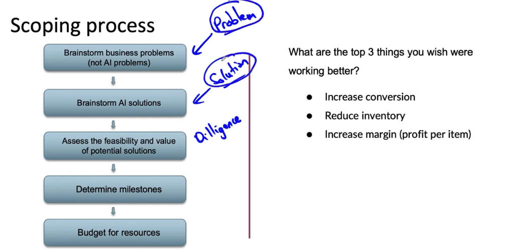
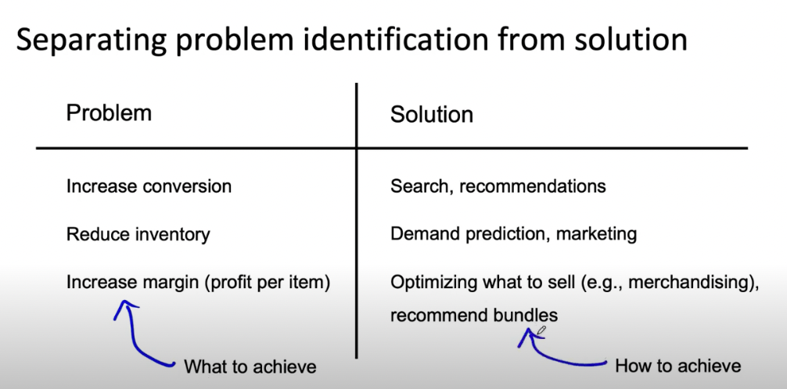

# Lesson 37

처음에 고객사와 인공지능 프로젝트에 대해 이야기를 나눌 때, 응 교수는 다음의 프로세스를 사용한다.

 

 

1. 문제의 식별: 인공지능 문제가 아닌 고객사의 비지니스 문제를 파악한다. 인공지능 문제가 아니다.
    * 예시
        - 웹사이트 방문자를 구매자로 전환시키기
        - 재고 줄이기
        - 아이템 당 이익(마진) 증가시키기
2. 해결책 제시: 고객사의 비지니스 문제들 중 인공지능으로 해결할 수 있는 문제가 있는지 확인하고 해결책을 브레인스토밍한다.
3. 다양한 해결책들의 실현 가능성과 가치를 평가한다.
    * diligence: 솔루션이 실제로 기술적으로 실행 가능하고 가치 있는지 두 번 체크하는 것 
4. 개발 이정표(단계)를 정립
5. 자원에 대한 예산 책정

 

 

* 문제: 방문자의 구매자로의 전환
    - 해결책
        - 사용자의 이해를 증대시키는 제품 디스플레이로 재설계
        - 검색, 추천 기능
* 문제: 재고 줄이기
    - 해결책
        - 수요 예측
        - 마케팅으로 수요 증대
* 문제: 마진 증가
    - 해결책
        - 무엇을 팔 지에 대한 최적화(상품화)
        - 패키지 추천(ex. 카메라 구입 시 케이스 묶어 팔기)

 

문제를 파악하는 것은 어떤 목표를 달성하고 싶은지 생각하는 단계이고 
해결책을 찾는 것은 그 목표를 어떻게 달성할 것인가를 생각하는 과정이다.

해결하려는 사업 영역이 본인이 잘 아는 영역일 수도 있지만 그럼에도 먼저 분산적 사고에 참여하여 많은 가능성을 생각하고 그 다음에 집중할 수 있는 가장 유망한 프로젝트로 축소하는 수렴적 사고로 이어지는 것을 추천한다.

        

