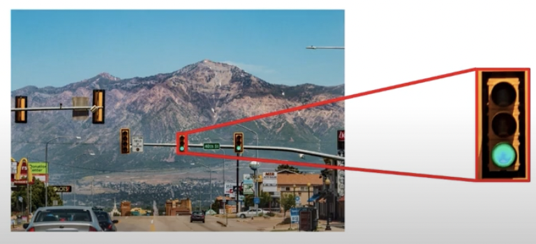
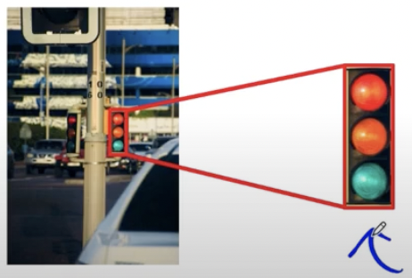
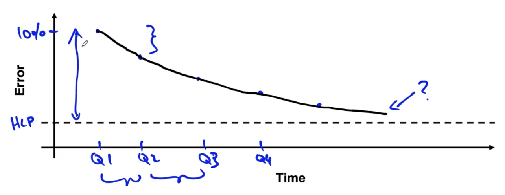

# lesson 38

## Dilligenve on feasility and value
- 프로젝트가 실제로 실행 가능한지, 얼마나 가치 있는지, 어떻게 수행하면 될지 알아보자.

### Feasibility: 해당 프로젝트는 기술적으로 실행 가능한가?
- 외부 벤치마킹(문헌, 타사, 경쟁사 등): 시스템 구축 전에 외부 기준이 있는지 탐색한다. 유사한 프로젝트를 누군가 구현했다는 의미이다. 따라서 벤치마킹 자료가 있다면 해당 프로젝트가 기술적으로 실현 가능하다는 것을 의미한다.

- 데이터 종류 별 실행 가능성 평가하기
    ||비구조화 데이터|구조화 데이터|
    |:---:|:---:|:---:|
    |데이터 예|음성, 이미지|거래 내역|
    |New(완전히 새로운 기능 제공)|HLP   알고리즘 테스트용 데이터를 동일하게 인간에게 제공하고, 인간의 예측 정확성 측정|target을 예측할만한 피쳐를 사용가능한가?|
    |Exisiting(기존 시스템 개선)|HLP  프로젝트의 예측 히스토리|새로운 예측 피쳐  프로젝트의 히스토리|

- 왜 벤치마킹에 HLP를 사용하는가?
    - 사람들은 비구조화 데이터 태스크에 능숙
    - 다음 이미지가 주어졌을 때 사람은 어떤 램프 등이 켜졌는지 맞출 수 있는가?

    |이미지1|이미지2|
    |:---:|:---:|
    |

|

|
    |사람이 판단 가능|사람이 판단 불가능|
    - 알고리즘이 인간이 판단하는 것과 동일한 것을 볼 수 있는지 확인해야 함
    - 알고리즘을 개선하는 것보다 카메라나 조명 성능에 투자하는 것이 나을 수도 있음

- 타겟을 예측하는 데 도움이 되는 피쳐를 가지고 있는가?
    - 과거 구매내역을 통해 미래 구매를 예측 (O)
    - 날씨가 주어졌을 때 쇼핑몰 내 방문객 수 예측 (O) 
    - DNA가 주어졌을 때 심장병을 예측 (?)
        - DNA는 noisy 맵으로 심장병을 약간만 예측 가능
    - 소셜미디어의 소문에 대한 정보가 있을 때 의류 트렌드를 예측 (?)
    - 과거 주가가 주어졌을 때, 미래 주가 예측 (X)

- 프로젝트의 히스토리
    

    - 분기별 발전률을 모니터링해 프로젝트의 성능 달성 시점을 가늠 가능