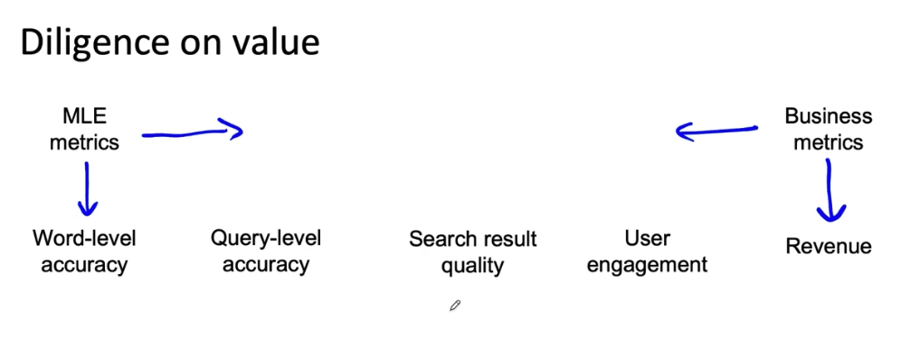

# Lesson 39

머신러닝 프로젝트 가치 혹은 성과를 평가하는 방법에 대해 다룬다.

예를 들어, 스마트폰으로 음성 검색이 가능한 앱을 만들다고 할 때, 머신러닝 엔지니어는 음성 인식과 음성 검색의 성능을 측정해야 한다.

머신러닝 엔지니어들이 최적화하기 위해 사용하는 평가척도(Machine Learning Estimation metrics)가 있다.

사업부 혹은 고객사에서 극대화하고자 하는 평가척도도 있다. 

이 둘 사이엔 종종 격차가 있다. 

 

 

* "단어 수준의 정확도"는 이 플젝에서 머신러닝 엔지니어들이 직접적으로 최적화하기 위해 평가척도로 사용하는 것이다. 
* 단어 수준에서 쿼리 수준 정확도, 검색 결과 품질 쪽으로 갈수록 검색의 엔드유저가 실감할 수 있는 평가지표이다.
* 검색 결과 품질이 좋아지면 사용자 참여가 증가할 것이다. 
* 수익은 궁극적인 사업적인 평가척도로 사용된다.
* ML 엔지니어들이 단어 수준 정확도에 집중하는 경향이 있다면 비지니스 리더는 수익에 대한 개선을 원한다. 
* 프로젝트가 진행되기 위해서는 기술팀과 비지니스팀 양쪽이 모두 만족할 수 있는 측정치에 동의해야 한다. 
    - 즉, ML팀은 좀 더 오른쪽으로, 비지니스팀은 왼쪽으로 평가를 움직여야 한다.
* 또 다른 방법은 Fermi estimate 가 있다.
    - 어떠한 문제에 대해 기초적인 지식과 논리적 추론만으로 짧은 시간 안에 대략적인 근사치를 추정하는 방법(from 위키피디아)
    - 단어 수준의 정확도 1% 향상이 쿼리 수준 정확도의 0.7% 향상을 만들 수 있고 이것이 검색 기능, 더 나아가 궁극적으로 수익까지 증대할 수 있는지 연결시켜 추정해본다.
    - ML 평가척도와 비지니스 평가척도를 연결시키는 방법 중 하나.

 

## 윤리적인 측면에서의 고려사항

기술의 성능과 윤리는 다른 측면에서 바라봐야 한다. 다음 것들을 고려할 수 있다. 

* 이 프로젝트가 긍정적인 사회적 가치를 만드는가
* 이 프로젝트가 합리적으로 공평하고 편견으로부터 자유로운지
* 윤리적인 문제나 가치에 기반한 문제들이 공개적으로 제기되고 논의가 되었는지

