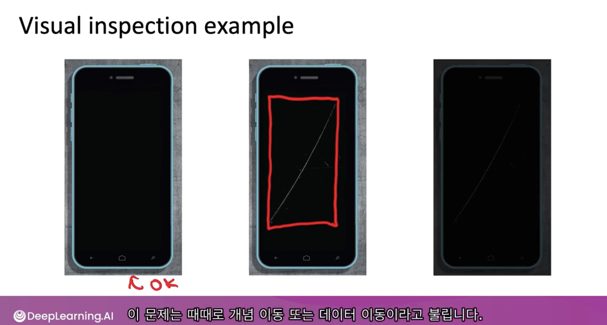
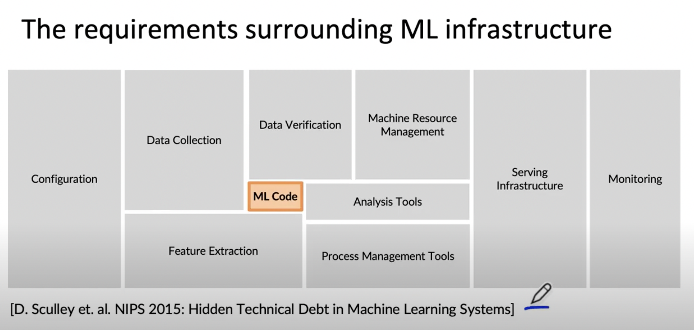

# Lesson 1

* 주피터 노트북이나 개발 환경에서 ML 모델을 학습시켜서 예측이 잘 되도록 한 것은 큰 성과이다.
* 다만 deploy 상황에서 해당 모델이 어떻게 작동하게 할 것인가는 또 다른 문제이다.

* 이 강의를 듣고 나면 ML project의 lify cycle 에 대해 배울 수 있을 것이다. 핵심은 모델 학습에서 배포까지의 과정이다. 

* 예를 들어 휴대폰 액정의 이상탐지 하는 비전 모델이 있다고 해보자.

 

 

* 왼쪽에서부터 첫 번째는 문제 없는 것이고 두 번째는 기스가 있다. 이는 둘 다 판별해낼 수 있다. 그런데 공장의 어떠한 조건 변화로 조명이 바뀌었을 때 세 번째 사진처럼 나올 수도 있다. 이를 해결하는 것은 ML 엔지니어가 하는 일이 아니라고 할 수 있지만 응 교수는 이런 상황에서도 잘 작동할 수 있도록 만드는 것이 중요하다고 생각한다. (정확한 멘트는 없지만 학습 데이터에 없는 저러한 예외적인 상황의 데이터를 지속적으로 피드백하며 확보하여 성능 개선하고 다시 배포하는 플로우를 만들 수 있도록 해보자는 것 같다.)

* 머신러닝에 쓰이는 코드는 전체 프로젝트 코드에 비하면 적은 양을 차지한다. 5~10% 보다 작을 수 있다. 나머지에는 데이터 수집, 검증, 기능 추출, 모니터링 등 다양한 요소가 있다. 

 

 

* 이 강의에서는 생산적인 배포를 위해 필요한 소프트웨어들에 무엇이 있는지 살펴본다
* ml project의 workflow를 정리하는데 유용한 프레임워크가 있다. 다음 강의부터 그 프레임워크에 대해 다룰 예정이다.
