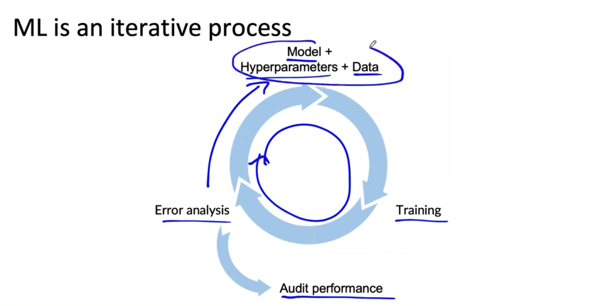

# Lesson 13

ML project를 시작하기 위한 몇 가지 팁을 알려주겠다!! 

 

 

ML 프로젝트는 위 그림과 같이 반복적인 과정이다. 

 

## 모델링을 시작할 때 팁

* 강의, 블로그, 오픈소스 프로젝트 등 가능한 많은 것들을 살펴보면서 무엇이 가능한지 살펴본다.
    * 배포를 위한 것이라면 최신의, 최고의 알고리즘을 찾는 데에 집착하지 말라. 배포 환경과 실제에 맞는 것이 중요하다.
* 사용가능하고 구현된 오픈소스가 있다면 효율적으로 기초를 다지는 데 도움이 된다
* 좋은 데이터가 없는 훌륭한 알고리즘보다 좋은 데이터가 있는 합리적인(적당한?) 알고리즘이 종종 더 좋은 성과를 낸다
* 빨리 개발해서 ML 개발 루프를 한 번 더 돌면 더 나은 성과를 만들 수 있다.

 

## 모델을 선택할 때 배포 제약을 고려하는지

* yes: 베이스라인이 이미 확보되어 있는 상태에서 목표가 시스템을 구축하고 배포하는 것이라면 디바이스와 같은 배포 제약사항을 고려해야 한다.
* no: 아직 베이스라인이 없거나 이 프로젝트가 제대로 작동할 지 모르겠다면 배포에 관해 심각하게 고려할 필요는 없다. 시작 단계에서는 일단 베이스라인을 확보하고 가능한 것을 결정하는 것이 우선이다. 

 

## 코드와 알고리즘이 온전한지 확인(Sanity check)

* 규모가 큰 데이터셋을 학습하기 전에 아주 작은 학습 데이터셋으로 과적합(overfit) 학습을 해본다. 
* 작은 데이터셋에서도 에러가 나는 경우가 많으니 확인이 필요하다. 오랜 시간에 걸쳐 학습이 거의 다 끝났는데 마지막에 실수 하나로 다 날아갈 수도 있다. 

 

---

다음 비디오에서는 오류 분석과 성능 검사에 대해 알아본다.