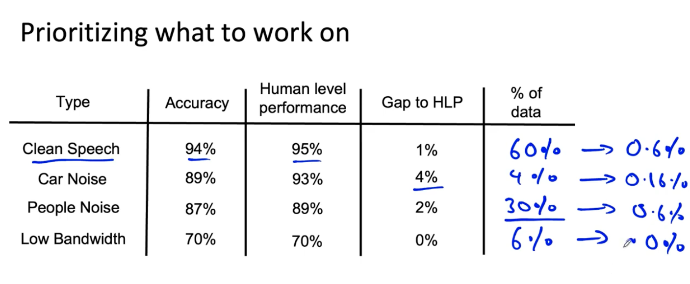

# Lesson 15

지난 강의에서 브레인스토밍과 데이터를 다른 속성으로 태그하는 것에 대해 배웠다. 
이런 태그를 기반으로 작업의 우선순위를 어떻게 부여할 지 알아볼 것이다.

 

 

* 위 테이블의 내용은 음성인식 데이터셋에서 데이터 속성을 네 가지로 나누고 각 정확도를 살펴본 내용이다.
    * 정확도는 각 타입 데이터에서 음성인식 시스템의 정확도를 말한다.
    * 인간 수준의 성능은 인간이 과제를 수행했을 때의 정확도를 말한다.
    * Gap to HLP 는 인간 수준 성능과 음성인식 시스템의 차이를 의미한다.
    * 새로 추가한 컬럼인 "% of data"는 해당 데이터의 비율이다.
        - 깨끗한 음성은 전체 데이터셋의 60% 를 차지한다.

 

## 우선순위 정하기

- **그 범주에 개선할 수 있는 부분이 얼마나 있는지에 따라 가장 중요한 범주를 선택할 수 있다.**
    - ex) 사람 수준과 비교하여 속성별 성능 향상의 가치 따지기
        - 깨끗한 음성의 정확도를 94%에서 95%(사람 수준)로 1% 올리면 시스템은 0.6% 더 정확해진다.(60% * 1% = 0.6%)
        - 맨 오른쪽 값은 모두 사람 수준까지 올릴 때의 시스템 성능 향상 비율이다.
    - 이런 계산을 바탕으로 보면 깨끗한 음성과 사람들 노이즈로 인한 데이터의 성능을 올리는 것이 자동차 노이즈 부분을 올리는 것보다 개선효과가 더 크다. 즉, 우선순위를 정할 때 데이터의 중요한 범주를 정할 수 있다.
- **그 범주가 얼마나 자주 등장하는지**
- **그 범주의 정확도를 향상시키는 것이 얼마나 쉬운지**
    - 예를 들어 자동차 노이즈 부분에서 정확도를 높일 수 있는 쉬운 방법이 있다면 작업 우선수위가 높아질 것이다.
- **그 범주를 개선시키는 것이 얼마나 중요한지**
    - 예를 들어, 자동차 내에서 지도 검색할 때 음성인식 기술을 통해 손에게 자유를 주는 것은 안전한 운전에 도움이 되기 때문에 자동차 노이즈 속에서 정확도를 높이는 것은 중요도가 높을 수 있다.

*어떤 것을 우선해야 한다는 완전한 정답은 없다. 상황을 잘 살펴보길 바란다.*

 

---

## 데이터 추가 혹은 데이터 품질 올리기

해당 범주의 정확도를 높이는 데에 데이터를 추가하거나 고품질의 데이터를 넣어주는 것은 가장 일반적인 방법이다.

 

* 더 많은 데이터 수집
* 데이터 증강 활용
* 레이블의 정확성이나 데이터 품질을 높인다

 

일반적인 데이터의 성능을 고루 높이는 것이 좋지만 비용과 시간이 많이 들어간다. 우선순위가 높은 특정 범주의 먼저 데이터를 개선하는 것이 효율적으로 성능 향상시킬 수 있는 방법이다. 
