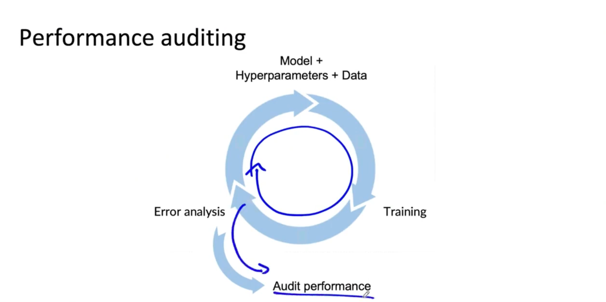

# Lesson 17

배포 전에 성능 검사를 하면 배포 후의 심각한 문제를 야기하지 않을 수 있다. 

## 성능 검사

 

이 성능 검사는 배포 전에 정확성, 공정성/편향, 다른 문제들을 점검하기 위해 두 번 체크하는 것이다.

1. 시스템이 잘못된 방향으로 가는 것이 아닌지 확인
    - 예) 
        - 특정 인종 혹은 성별 집단에서도 잘 작동하는지 확인
        - 왜곡된 데이터셋에서 나타날 수 있는 특정 에러가 자주 나타나는지 확인
        - 희귀 클래스에서의 성능 확인
2. 위와 같은 문제들을 다루기 위한 적절한 일부 데이터에서의 검사를 위한 평가지표를 설정
    - 예)
        - 특정 인종에 대한 데이터에 대해서만 평가
        - 다른 장치에서의 정확도 평균
    - TensorFlow Model Analysis(TFMA): 텐서플로우에서 제공하는 모델 평가 라이브러리이며 이를 이용하면 새로운 데이터가 유입되었을 때 특정 데이터 조각에 대해 성능 검사를 할 수 있다.
3. 해당 비지니스 혹은 제품의 소유자에게 이러한 문제들이 걱정할 수 있는 가장 적절한 문제들이라는 것을 받아들일 것을 권고

 

추가적으로 혼자 검수하기보다는 제3자의 검수를 통해 새로운 관점의 문제점을 확인하는 것도 좋은 방법이다.
