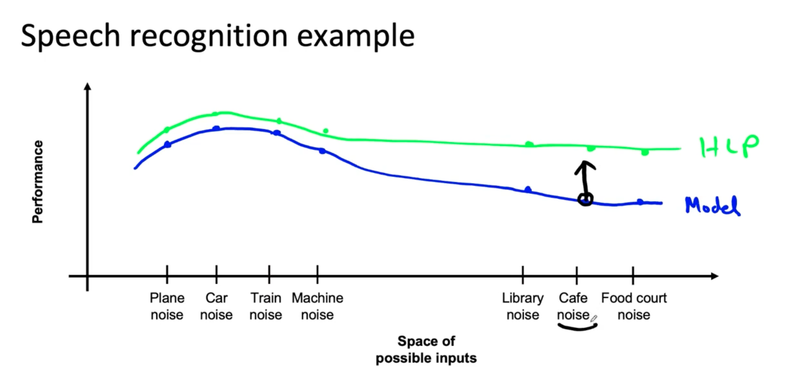
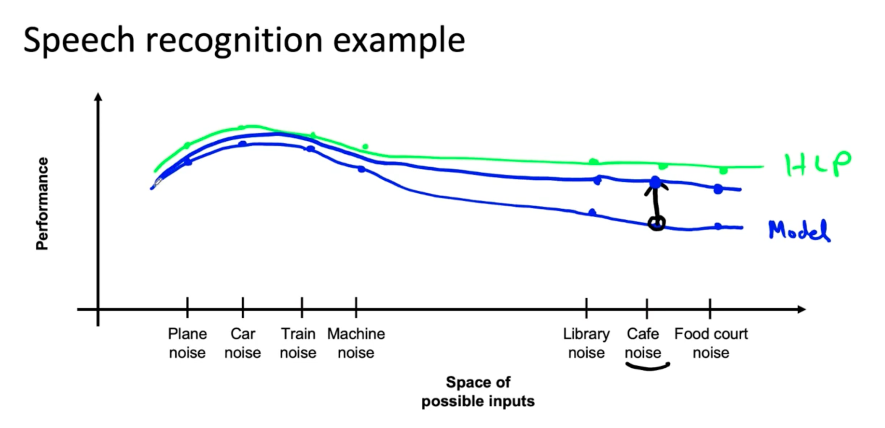

# Lesson 19

데이터 증강과 학습 관련 해서 성능 향상에 도움이 될 그림을 보여주겠다.
데이터 증강을 해야 할지 결정할 때 유용하게 사용할 수 있을 것이다.

---

## 음성 인식 예제

 

### 여러 종류의 음성 입력 유형

* 차 소음
* 비행기 소음
* 기차 소음
* 기계(세탁기, 에어컨) 소음
* 카페 소음
* 도서관 소음
* 푸드 코드 소음

앞선 네 가지와 그 다음 세 가지로 묶일 수 있다. 전자는 기계적인 유형의 소음이고 후자는 사람들이 소통하며 나오는 소음이다. 

 

 

- y축은 성능, 정확도를 말한다. x축은 가능한 입력 공간이다. 
- 파란색은 각 입력 유형에 따른 모델의 성능이고, 초록색은 인간의 성능이다.
- 카페 소음 부분에서 모델과 인간 성능 차이가 가장 크다. 이 지점을 공략하자.

 

- 카페에 찾아가 해당 유형의 데이터를 수집해서 성능을 끌어올리면 카페 소음과 유사한 형태의 소음 성능도 올라갈 것이다. 
- 한 점을 끌어올리면 근처 점들은 많이 올려지고 멀리 있는 점들은 조금이라도 올라갈 수 있다. 
- 목표로 하는 성능(보통 인간 수준)과 비교했을 때 그 차이가 가장 큰 부분의 데이터를 개선하여 학습하고 또 테스트한다. 오류 분석은 새로운 가장 큰 차이를 알려줄 것이다. 이런 사이클을 통해 목표치에 도달하려고 하자. 

 

---

다음 비디오에서는 데이터 증강을 수행하는 방법에 대해 알아보겠다.