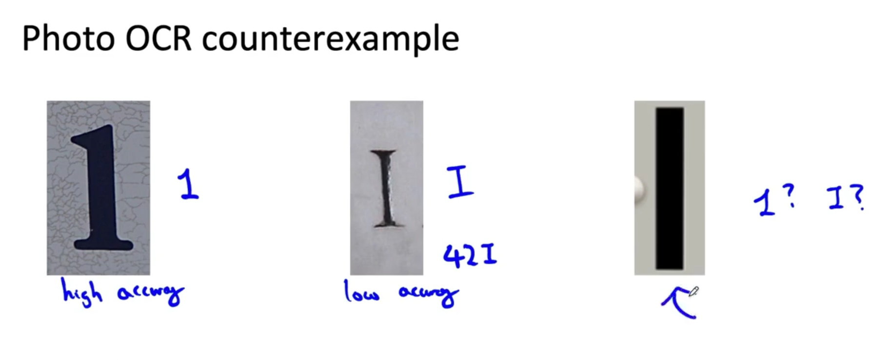

# Lesson 21

데이터셋의 특정 태그 데이터를 데이터 증강을 활용하여 추가한다면 기존의 균형 있는 데이터셋의 분포를 어지럽힐 것이다.
이것이 성능을 떨어뜨릴까? 경우에 따라 다르다.

## 데이터 추가가 성능에 미치는 영향

* 비구조화된 데이터는 다음과 같은 조건일 때 데이터 추가가 성능 감퇴로 이어질 확률이 적다.
    - 모델이 충분히 클 때(low bias)
        * 음성인식 예
            - 카페 소음이 20%였는데 이를 50%를 늘렸을 때, 모델이 충분히 크다면 카페 소음 이외의 태그 데이터에서도 성능이 떨어지지 않음이 밝혀졌다.(구체적으로 어떤 근거인지는 말하지 않음.)
    - x $\rightarrow$ y 매핑이 명확할 때 (인간이 판단했을 때 정확한 판단을 할 수 있는 정도)
        * OCR 예제
            - 1 과 I를 구분하는 문제에 있어서 세 번째 문자는 사람이 봐도 모호하다. 즉, 이런 데이터셋을 추가하면 성능 감퇴로 이어질 것이다.

 

 

---

구조화된 데이터에서는 어떨지 다음 비디오에서 살펴보겠다.

        

