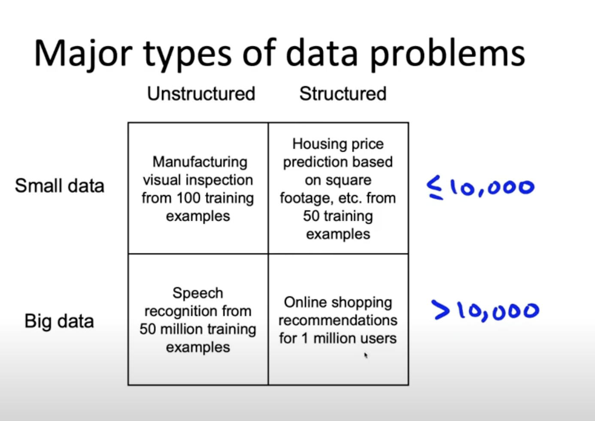

# Lesson 27

한 종류의 데이터셋에 대한 처리가 다른 종류의 데이터셋에 동일하게 적용했을 때 동일한 효과를 보장할 수 없다. 

 

 

* 데이터셋의 크기 구분은 임의로 만 개로 한다.

### 비구조화된 데이터 vs 구조화된 데이터
* 비구조화된 데이터셋에서는 인간이 한 레이블 기반으로 혹은 전처리 기술로 나온 데이터를 증강할 수 있다.
    - ex) 이미지 합성 혹은 오디오 클립을 이용해서 증강
* 구조화된 데이터는 더 많은 데이터를 모으고 증강하는 것이 어려울 수 있다.
    - ex) 인간이 레이블링하게 할 수는 있지만 실제로 존재하지 않는 집 가격과 사용자를 만들어내긴 어렵다.

### 작은 양의 데이터 vs 큰 양의 데이터
* 데이터셋 크기가 작으면 정확하고 일관된 레이블은 매우 중요하다
* 데이터셋이 클 때는 모든 데이터셋을 살펴보는 것이 어렵기 때문에 데이터를 수집하고 저장하는 방식의 측면에서 그 과정을 강조한다. 

## 팁

유형을 네 가지로 나눴을 때 같은 지역에 있는 데이터셋에 적용한 데이터 처리 전략이 다른 지역의 것보다 유용할 것이다. 
