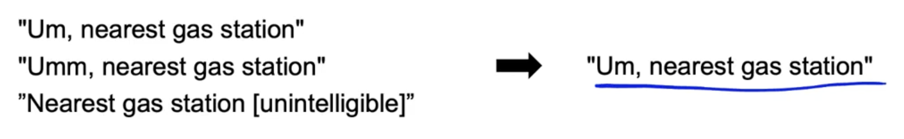
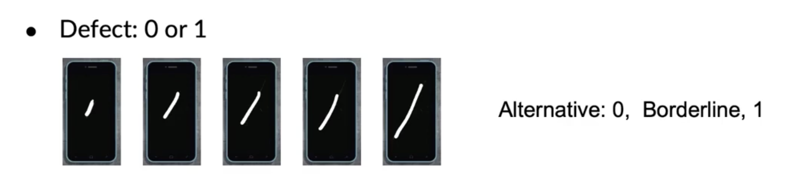
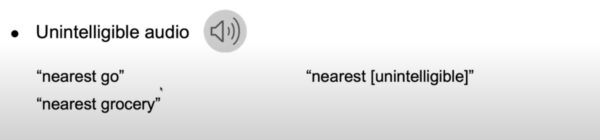

# Lesson 29

레이블의 일관성을 향상시킬 수 있는 몇 가지 방법에 대해 살펴본다.

* 여러 명의 레이블링 작업자에게 동일한 예제로 작업하게 한다.
* 만약 레이블링 결과가 일치하지 않으면 그들끼리 논의하고 합의에 도달하도록 자리를 만든다. 또한 그 합의를 문서화하고 기록하여 다시 볼 수 있도록 한다.
* Y의 정의는 새로운 데이터를 표시하거나 오래된 데이터를 다시 표시할 수 있는 업데이트된 라벨링 명령의 집합이 될 수 있다. 
* x가 충분한 정보를 가지고 있지 않다고 한다면 입력 x를 변경하는 것에 대해 고려해본다. 

## 예제

* 레이블 정의의 표준화
    - 오디오 혹은 비디오 데이터에서 동일한 음성에 대해 3개의 문장으로 전사했다고 할 때, 오른쪽 문장으로 통일하면 레이블의 일관성을 높일 수 있다.

 

 

* 클래스 병합
    - 깊은 스크래치와 얕은 스크래치가 있다고 할 때, 이 두 개를 구분하는게 필요할 때도 있지만 단순히 스크래치가 있는지 불량 여부를 판단하는 경우에는 이 두 개를 합침으로써 레이블링 작업자들의 고민을 덜어줄 수 있다. 
    - 클래스를 합치는 것이 항상 옳은 것은 아니지만 작업을 단순화한다는 장점을 지닌다. 

 

 

* 불확실성을 포착하기 위한 클래스/레이블 추가
    - 스크래치의 크기에 따른 결함 여부를 판단해보자.
    - 맨 오른쪽의 스크래치는 완전히 결함이라고 볼 수 있지만 맨 왼쪽의 작은 스크래치는 결함이 아니다.
    - 그렇다면 가운데에 중간 크기의 스크래치는 결함일까 아닐까
    - 일부 예가 모호하면 그 예들이 경계선에 있다고는 레이블로 처리한다.

 

 

다음 음성처럼 모호할 때는 오른쪽 괄호처럼 표시를 하는 것도 하나의 방법이다. 이는 추측해서 레이블의 일관성이 떨어지는 것을 막을 수 있다. 

 

 

## 작은 데이터셋 vs 큰 데이터셋 (비구조화된 데이터)

* 작은 데이터셋
    - 적은 수의 레이블러
    - 특정 레이블에 대해 토의하도록 레이블러에게 요청할 수 있다. 
* 큰 데이터셋
    - 작은 그룹으로 일관된 정의를 하도록 요청(일관성 없음)
    - 그 후에 레이블링 지시사항을 레이블러에게 보냄
    - 여러 레이블러가 각각의 예제에 대해 레이블링을 해보고 정확도를 높이기 위한 투표나 논의를 하도록 한다.(일관성 향상)
    