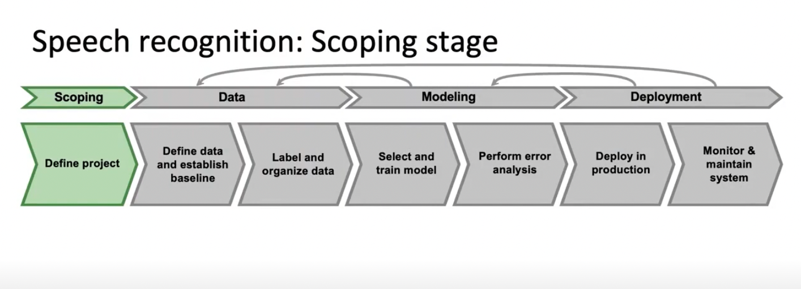
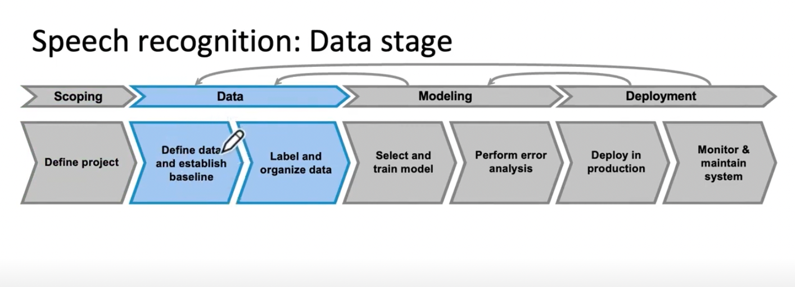
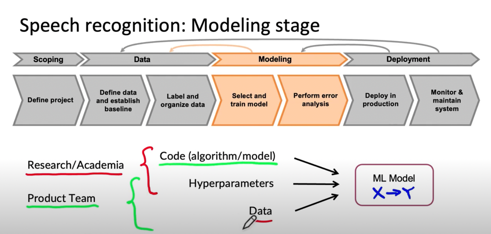
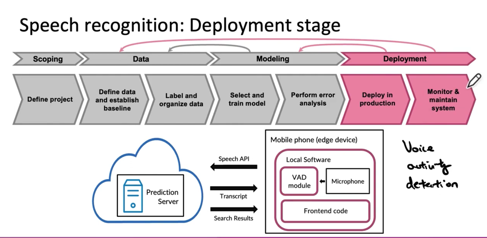

# Lesson 3

예제를 통해 머신러닝 프로젝트 라이프 사이클에 대해 더 자세히 알아보겠다.  
이번 강의에서는 가치 있는 생산 배포용 음성 인식 시스템을 구축하기 위해선 어떤 것이 필요한지 머신러닝 프로젝트 라이프 사이클 관점에서 살펴보겠다.
시스템을 구축하고 배포하는데 필요한 모든 단계를 이해할 수 있을 것이다.

## 1. Scoping

 

 

* 프로젝트 정의
* key metrics 를 결정 (혹은 최소한 추정)
    - 모든 어플리케이션은 고유한 목표와 측정값이 있다.
    - 음성 인식의 경우 정확도, 답변 지연시간, 한번에 처리할 수 있는 양이 있다.
    - 사용할 수 있는 자원(ex. device)과 타임라인도 결정 대상이다(ex. 시기별 목표)

 

## 2. Data 

 

 

* 데이터를 정의하고 기준을 정한다
* 데이터에 레이블을 붙인다

 

### 데이터 정의에서 이슈

-  데이터 레이블링의 일관성이 현실적인 이슈사항이다.
    - 여러 레이블링 작업자 각자가 자신만의 기준을 가지는 데이터로 학습할 경우 영향이 있다.
- 각 클립 전후로 소음을 통제할 수 있는지
- 여러 소리가 들릴 때 그 소리들을 normalize 할 수 있는지(A는 크게 말하고 B는 작게 말할 경우 대응)

 

### 지속적인 데이터셋 개선 필요
* 보통의 머신러닝 프로젝트는 고정된 데이터셋을 활용하여 학습하고 테스트한다. 하지만 production 단계에선 고정된 데이터셋을 활용하면 변하는 환경에 대응하기 어렵다.
* 생산 시스템을 더 잘 작동시키기 위해서는 종종 학습 데이터셋과 테스트 데이터셋을 변화시켜야 한다. 
* 효과적으로 데이터셋 품질을 개선하는 것은 어떻게 해야 할까?

 

## 3. Modeling

 

 

* 모델을 선택하고 학습시킨다
    - ML model을 얻기 위해 코드(알고리즘/모델), 하이퍼패러미터, 데이터를 선택하고 학습을 시킨다.
    - 연구 쪽에서는 코드와 하이퍼패러미터에 집중하는 경향이 있는데, 생산 쪽에서는 하이퍼패러미터와 데이터에 더 집중하는 경향이 있다.
    - 코드는 오픈소스를 활용하고 그 도메인에 맞는 데이터를 많이 모아서 하이퍼패러미터 튜닝에 힘쓰는 것이 더 효율적이다.
* 학습한 모델의 오류 분석
    - 오류 분석을 통해 위 세 가지 중 어떤 것이라도 개선하면 된다. 
        - 데이터의 양을 무조건 늘릴 것이 아니라 품질을 높여서 비용을 줄이고 성능을 높일 수 있다. 

 

## 4. Deployment

 

 

* 휴대폰에 음성인식 시스템을 배포할 때 보통 위 그림과 같은 아키텍쳐가 필요하다.
* 배포가 된 이후에도 시스템을 모니터링하고 유지해야 한다

### Concept/Data drift

- 예를 들어, 기존에 성인의 목소리를 데이터셋으로 사용한다고 했을 때 어린 사람의 목소리는 인식률이 떨어지는 상황이 있을 수 있다.
- 배포에서 중요한 과제 중 하나는 개념의 이동 또는 데이터의 이동이다.
    - 데이터 분포가 변할 때 일어난다
- 새로운 입력(어린 사람의 목소리)을 수집하고 문제점을 파악하여 고쳐야 한다.
