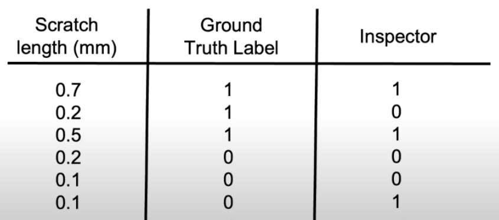
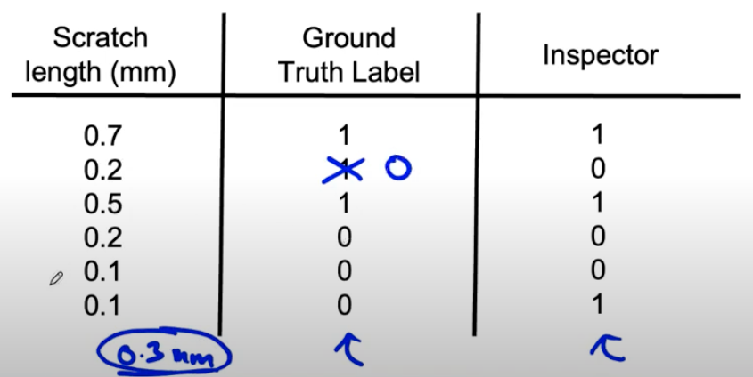

# Lesson 31

## 인간 수준 성능(HLP) 높이기

* ground truth 레이블이 외부에서 정의(절대적 기준이 아니라 인간이 내린 정의)될 때 HLP는 베이즈 오류와 irreducible error(X와는 의존적이지 않지만 Y에 영향을 미치는 요소들)에 대한 추정치를 제공한다.
* 문제는 종종 이런 ground truth 는 단순히 또 다른 인간의 레이블일 수 있다.
* 예시

 

 

휴대폰 스크래치 시각 검사의 예시를 살펴보자. 
ground truth 와 비교했을 때 인간의 검사(HLP)는 66.7% 의 정확도를 보였다. 

스크래치 길이에서 0.3 mm 을 결함의 역치라고 했을 때 ground truth 2번째 행은 1이 아니라 0(결함없음)이 된다. 그러면 인간 검사(HLP)의 정확도는 66.7% 에서 83.3% 로 올라간다. 

 

 

시스템이 목표로 하는 HLP의 수준이 더 높아져서 HLP를 이기는 것이 더 어려워졌다. 사실 지금은 83퍼이지만 지침이 명확하니 100%까지도 가능하다. 100%를 이기는 것은 불가능하다. 다만 이것의 장점은 정확도를 올렸다는 것보다는 더 깨끗하고 일관된 데이터를 가지고 있다는 점이다. 궁극적으로는 이것이 학습 알고리즘을 더 잘 작동하게 해줄 것이다.

 

만드려는 시스템의 개발 목표가 HLP를 이기는 것이 아니라 정확한 예측을 만들어내는 학습 알고리즘을 만드는 것이라면 이 접근 방식이 더 유용하다.

 

## 요약

* 레이블 y가 인간의 레이블에서 올 때, HLP 가 100% 보다 약간 미치지 못하다면 이는 레이블링 지침이 모호할 수도 있다는 점을 고려하자.
    * 이전 강의에서 음성인식 예제에서 umm,, umm.. 이런 예시에서도 확인할 수 있다.
* 레이블 일관성을 높이면 HLP 가 올라갈 것이다.
* 이는 HLP를 이기기 어렵게 만들 것이다. 하지만 더 일관된 레이블은 ML 성능을 높일 것이고 실제 어플레이케이션 성능 향상에 도움이 될 것이다.

---

## 구조화된 데이터에서 인간 수준 성능

* 앞선 내용은 비구조화된 데이터에 해당하는 것이다. 하지만 위 내용 중 일부는 구조화된 데이터에도 적용 가능하다.
* 구조화된 데이터 문제는 인간 레이블러가 개입할 여지가 적은 편이어서 HLP 도 적게 사용되는 편이지만 예외는 있다.

### 예시

다음과 같은 예시들에 대해서는 첫 번째로 인간에게 데이터를 표기하도록 하는 것이 합리적이다.

- 유저 ID 통합에 대한 내용: 같은 사람인지
- 네트워크 트래픽인지 해킹 공격인지
- 사기 거래인지?
- 스팸 계정인지? 봇인지?
- GPS로부터 교통수단이 어떤 것인지?

인간이 내린 레이블이 정답으로 여겨지기 때문에 비구조화된 데이터에서 사용한 방법이 동일하게 적용될 수 있다. 