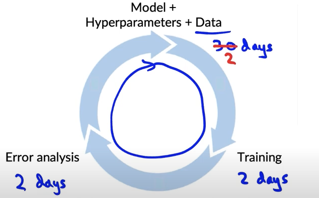
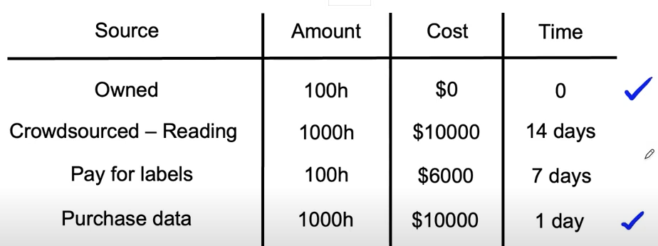

# Lesson 32

## 데이터 확보 시 고려사항

### 1. 데이터를 얻는 데 걸리는 시간

- 짧은 기간 데이터를 수집 후 머신러닝 사이클에 빨리 들어가도록 권장
    - 데이터 확보시간을 기다린 후 머신러닝 사이클이 시작되면 프로제트 자체가 지연될 수 있음
- 데이터 사이즈에 관해 던져야 하는 질문?
    - (X, 지양) 원하는 데이터 개수(m개)를 확보하는 데 걸리는 시간
    - (O, 권장) 특정 기간(k일) 동안 데이터를 수집할 시간이 주어질 때 확보 가능한 데이터 사이즈 
- 예외사항: 이전에 경험했던 프로젝트라면 경험적으로 필요한 데이터 사이즈에 대한 사전지식 있음
- 정확히 필요한 데이터 사이즈를 모른다면 머신러닝 사이클에 빨리 들어갈 것

### 2. 데이터 확보 출처

- 필요한 데이터의 출처 목록을 브레인스토밍하기
    - 데이터 출처 별 데이터 사이즈와 가격, 확보하는 데 걸리는 시간: 품질과 양에 따라 가격이 천차만별, 프로젝트의 일정과 예산, 필요한 데이터 사이즈에 맞게 출처 선택    
    - 음성인식 데이터 확보 예제: 출처, 사이즈, 가격, 확보 시간에 따라 출처 조합 선택

    

        - 기타 고려 사항: 데이터 품질, 개인 정보, 보호 & 규제 제약 등

### 3. 데이터 라벨링
- 선택: 사내 vs 아웃소싱 vs 크라우드소싱
- 머신러닝 엔지니어가 라벨링을 담당하는 비용은 비싸지만, 며칠의 작업으로 가능하다면 괜찮은 선택지
- 라벨링에 적합한 사람?
    - 음성인식: 데이터 대상 언어에 유창한 사람
    - 공장 검시자, 의료 이미지 진단: 중소기업이나 해당분야 전문가(SME, subject matter expert)
    - 추천 시스템: 레이블을 붙이기 어려운 경우 추천 시스템 이용, 사람에 의한 라벨링 보다는 사용자 추천 데이터로부터 라벨을 얻음
- 한번에 10배 이상 데이터를 증가시키지 말 것
    - 10배 이하의 데이터를 추가 확보 후 모델 학습 & 오류 분석 수행
    - 데이터가 급격히 늘어나면 문제 상황이 바뀔 수 있음, 점진적으로 데이터 증가, 나아가 데이터 확보에 과한 예산 분배 방지