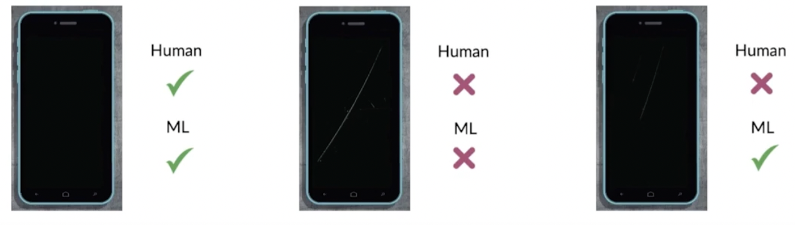
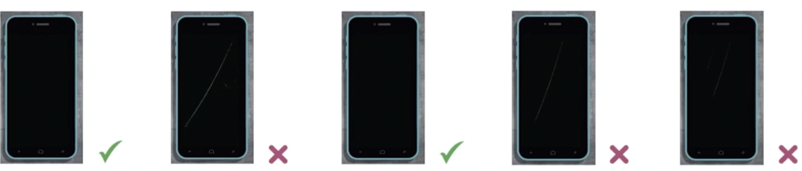
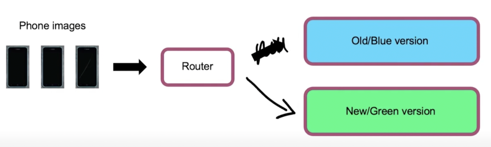
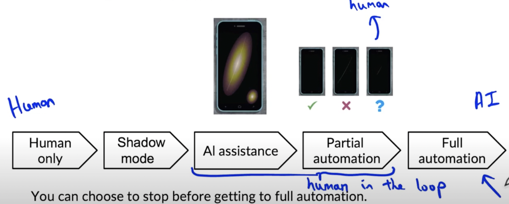

# Lesson 6

## Deployment Patterns
- 사용사례에 따라 배포의 방식은 달라진다.
- 배포 vs 유지보수: 다른 차원의 문제

##  I. 배포 유형 개요
1. 새로운 제품/기능: 작은 양의 트래픽에서 점진적으로 양을 늘림 ex. 이전에 없던 서비스 오픈
2. 수작업을 자동화/지원: 이미 사람이 하고 있는 일을 서비스가 지원, 그림자 모드 배포 이용
3. 이전 ML 시스템을 대체: 이미 시행되고 있던 머신러닝 서비스를 더 나은 머신러닝 서비스로 대체
    - Key Ideas
        - 모니터링을 통한 점진적인 개선: 새 시스템이 완전히 증명되지 않았기 때문에 처음에는 적은 양의 트래픽으로 새 시스템 모니터링, 검증결과에 따라 점진적으로 트래픽 양을 늘림
        - Rollback: 새 알고리즘 시스템이 작동하지 않으면 이전으로 되돌림

## II. 시각검사예제를 통한 배포의 이해
## 배포의 유형
- 스마트폰의 결함 검사 예제
1. 그림자 모드 배포
     

 
    그림1. 인간검증과 ML 시스템 검증 결과 비교
    - "shadow": 누군가로부터 무엇을 배우기 위해 함께한다는 의미
    - 인간검사과 병행해 기계학습검사가 진행됨
    - 초기에는 기계학습검사의 결과가 어떻든 인간의 결과를 따름
    - 알고리즘의 수행방식과 인간의 판단결과를 비교하면서 알고리즘 정교화, 미래에 알고리즘을 사용할 것인지 결정
    - 알고리즘 사용 전 성능을 확인하는 효과적인 방법
2. 카나리 배포
     

 
    그림2. 몇 개의 예제만 결함 검증
    - "canary in coal mine": 석탄 광부들이 가스 누출 감지를 위해 카나리아 새를 파견, 적은 노력으로 조기에 문제 발견하는 것을 빗댐
    - 5%나 그 이하의 적은 양의 트래픽까지만 확장 적용
    - 적은 양의 트래픽 중 오류 탐색
    - 시스템을 모니터링하고 성능이 검증되면 트래픽 확장
3. 파란색-녹색 배포
     

 
    그림3. 구시스템에서 신시스템으로의 전환
    - 파란색 버전: 오래된(기존) 소프트웨어 시스템
    - 녹색 버전: 최신(새로 만든) 시스템
    - 파란색(기존) 버전 시스템으로 이미지를 검증하던 일을 멈추고 녹색(새로 개발된) 버전 시스템으로 이미지 검증, 문제가 생기면 파란색 버전으로 되돌림(roll back)

## 자동화의 수준
- 자동화를 양자택일(자동화를 시행, 미시행)의 개념으로 이해하지 말 것, 적절한 자동화 수준으로 시스템을 구축해야 함
 

 
그림4. 왼쪽에서 오른쪽으로 자동화가 점진적으로 진행됨
- 자동화 수준 별 단계
    1. 인간이 모든 결함 판단 
    2. 그림자 모드로 알고리즘 적용(인간업무와 알고리즘 병행), 의사결정에는 영향을 미치지 않음 
    - 3~4: human in the loop 배포(인간이 어느정도 개입된 배포)
    3. AI 판단을 참고해 인간이 판단, 이 경우 서비스 UI, 인터페이스가 중요
    4. 부분적 자동화, AI 알고리즘이 판단을 어려워하는 것만 인간이 판단, 나머지는 AI 알고리즘이 판단
    5. 완전 자동화: AI가 모든 결함 판단
- 서비스의 특성에 따라 적정 자동화 수준이 다름
    - 검색시스템: 사용자의 검색마다 인간이 개입할 수 없으므로 완전 자동화가 적절
    - 휴대폰 결함 시각 검사: 인간의 판단이 어느정도 개입된 human in the loop 수준이 적절
