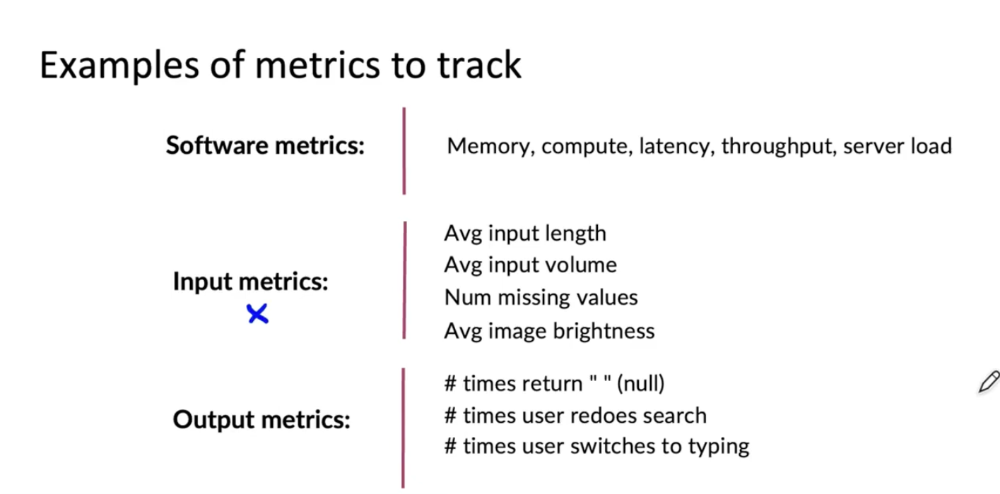
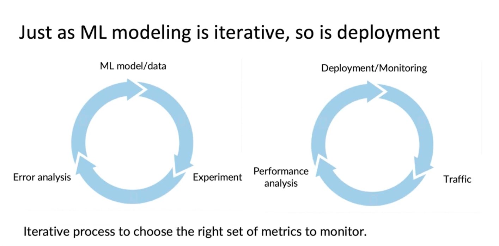
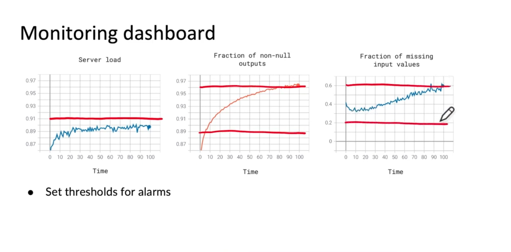
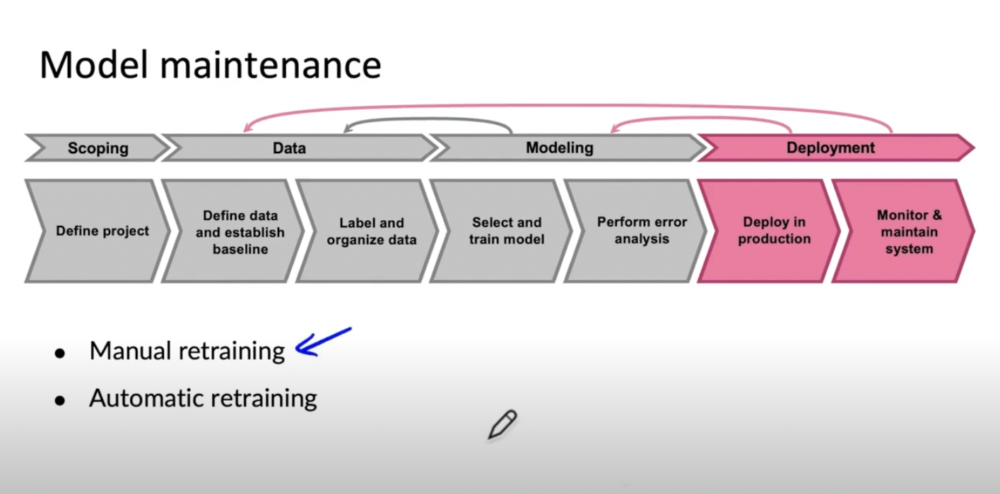

# Lesson 7

이 강의에서는 배포한 ML system을 모니터링하는 방법에 대해 알아본다.

## 대시보드

* 가장 일반적인 방법은 대시보드에 각종 지표를 올려놓고 이상 탐지하는 것이다.
* 무엇이 잘못된 상황인지, 문제를 감지할 수 있는 통계 수치와 척도가 무엇인지 정리해야 한다.
* 처음에는 다양한 지표를 사용하고 점차적으로 쓸모없는 지표 및 척도는 지운다.
* 예시는 다음 같은 것들이 있다.

 

 

* software metrics: 말 그대로 software 들이 잘 작동하고 있는지를 살펴볼 수 있다.
* input metrics: 입력 데이터가 어떤 형태인지 확인할 수 있다.
* output metrics: 출력값이 어떤 형태인지 확인 가능하고 변하고 있는지도 살펴볼 수 있다.
* input, output metrics는 해당 프로그램에 특수한 경우가 대부분이라 별도로 그 앱에 맞춰서 만들어야 한다.

 

 

* 머신러인 모델링은 반복적인 작업이다. 학습 데이터를 모으고 학습한다. 실험을 해보고 오류 분석을 하여 모델이나 데이터를 개선하는 방법을 찾아낸다. 이 루프를 반복하면 좋은 모델을 얻을 수 있다.
* 배포도 비슷하게 반복적인 과정을 거친다. 배포 후에 대시보드를 설치하는 것은 시작이다. 실제 트래픽에서 어떻게 수행되는지 성능을 분석해봄으로써 시스템을 개선하여 다시 배포할 수 있다.

 

 

* 메트릭을 설정했을 때 주로 설정한 임계치를 넘으면 알람을 주도록 한다.
    - 예를 들어, 서버 부하가 0.91이 넘으면 메신저나 메일을 통해 팀원에게 알림이 가도록 하여 문제가 있는 것인지 아니면 트래픽이 증가하여 서버를 증가시킬지 판단하도록 할 수 있다.
    - non-null 값을 출력값으로 내는 비율이 임계치를 넘으면 알림이 가도록 한다.
    - 입력값의 누락 비율이 임계 범위를 벗어나면 알림이 가도록 한다.
* 시간이 지남에 따라 임계치와 평가척도를 수정하여 이상 탐지를 최적화해야 한다.

 

 

* 수동 재학습: 알림 설정을 통해 이상 탐지를 하면 오류 및 성능 분석을 통해 개선점을 찾고 재학습하여 배포하는 과정
* 자동 재학습: 위 과정을 자동으로 수행함
