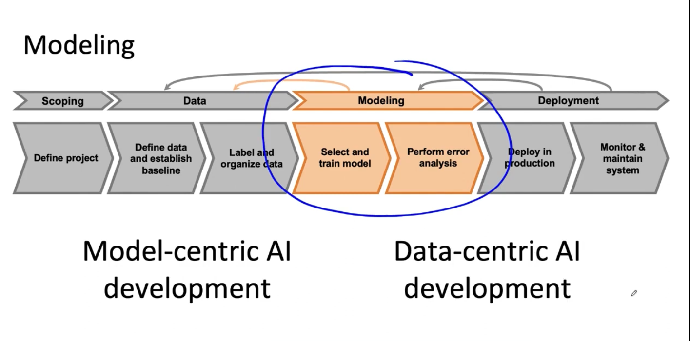

# Lesson 9

이 강의에서는 생산/배포를 위한 머신러닝 모델링에 대해 다룬다. 
나의 강의 혹은 여러 선임 머신러닝 엔지니어들은 머신러닝 모델링에 대해 일관된 조언들을 한다. 
이번에 머신러닝 모델링을 위한 핵심과제들이 어떤 것이 있는지 알아볼 예정이다. 

구체적으로 모델을 선택하고 훈련하는 방법과 오류 분석을 수행하고 모델을 개선하는 데 사용하는 방법에 대해 배운다.

---

 

 

* 모델 중심 AI 개발과 데이터 중심 AI 개발이 있다. 
* 인공지능이 성장하는 방식은 모델 중심 개발이 중점으로 이루고 있다. 그러나 응 교수는 실제에서는 데이터 중심 개발이 더 유용하다는 것을 강조한다.
* 알고리즘에 고품질의 데이터를 추가로 공급함으로써 개선하는 것이다. 단순히 많은 양의 데이터를 추가하는 것이 아니다. 효율적으로 고품질의 데이터를 수집하는 방법을 써야 한다. 